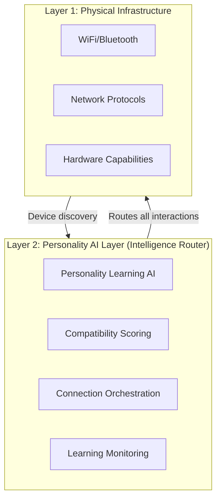

# Architecture Layers Diagram

**Created:** December 8, 2025, 5:32 PM CST  
**Purpose:** Visual diagram of architecture layers

---

## 📊 **ASCII Diagram**

```
┌─────────────────────────────────────────────────────────────┐
│                    ARCHITECTURE LAYERS                       │
└─────────────────────────────────────────────────────────────┘

┌─────────────────────────────────────────────────────────────┐
│                    Layer 2: Personality AI Layer             │
│                    (Intelligence Router)                      │
│                                                               │
│  ┌─────────────────────────────────────────────────────┐   │
│  │  Personality Learning AI                             │   │
│  │  - Creates and evolves user AI twins                │   │
│  └─────────────────────────────────────────────────────┘   │
│  ┌─────────────────────────────────────────────────────┐   │
│  │  Compatibility Scoring                               │   │
│  │  - Calculates personality spectrum matches          │   │
│  └─────────────────────────────────────────────────────┘   │
│  ┌─────────────────────────────────────────────────────┐   │
│  │  Connection Orchestration                            │   │
│  │  - Routes all device interactions                   │   │
│  └─────────────────────────────────────────────────────┘   │
│  ┌─────────────────────────────────────────────────────┐   │
│  │  Learning Monitoring                                 │   │
│  │  - Tracks personality evolution and interactions    │   │
│  └─────────────────────────────────────────────────────┘   │
└─────────────────────────────────────────────────────────────┘
                            │
                            │ All device interactions
                            │ route through this layer
                            │
┌─────────────────────────────────────────────────────────────┐
│                    Layer 1: Physical Infrastructure          │
│                                                               │
│  ┌─────────────────────────────────────────────────────┐   │
│  │  WiFi/Bluetooth                                     │   │
│  │  - Device discovery and proximity detection         │   │
│  └─────────────────────────────────────────────────────┘   │
│  ┌─────────────────────────────────────────────────────┐   │
│  │  Network Protocols                                   │   │
│  │  - Connection establishment and data transmission   │   │
│  └─────────────────────────────────────────────────────┘   │
│  ┌─────────────────────────────────────────────────────┐   │
│  │  Hardware Capabilities                               │   │
│  │  - Device sensors and connectivity hardware         │   │
│  └─────────────────────────────────────────────────────┘   │
└─────────────────────────────────────────────────────────────┘
```

---

## 🔄 **Mermaid Diagram**



---

## 🎯 **Key Principle**

**All device connections route through Personality AI Layer, NOT direct peer-to-peer.**

```
Device A → Personality AI (decides connection) → WiFi/Bluetooth → Device B
```

**NOT:** `Device A → Direct WiFi/Bluetooth → Device B`

---

## 🔗 **Related Documentation**

- **Architecture Layers:** [`../ARCHITECTURE_LAYERS.md`](../ARCHITECTURE_LAYERS.md)
- **Network Flows:** [`../NETWORK_FLOWS.md`](../NETWORK_FLOWS.md)

---

**Last Updated:** December 8, 2025, 5:32 PM CST

