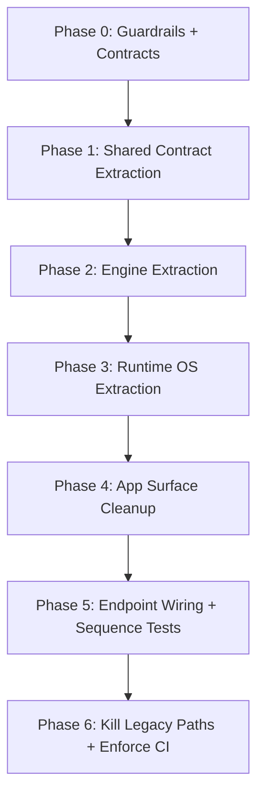
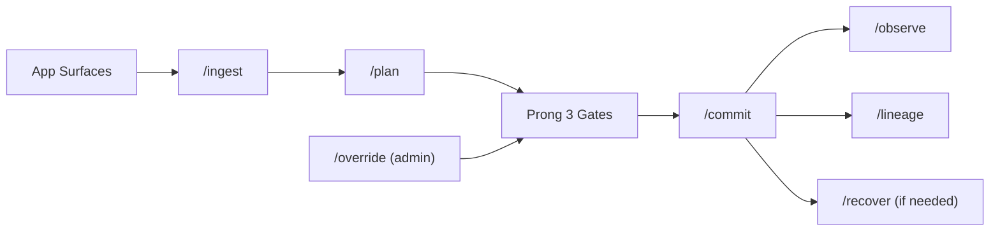

# Codebase Migration Checklist: 3-Prong Target Architecture

**Date:** February 27, 2026  
**Status:** Actionable migration checklist (current repo mapped)  
**Purpose:** Convert current AVRAI codebase into strict `apps -> runtime -> engine -> shared` architecture with minimal breakage and clear execution order.

**Companion docs:**
- `docs/plans/architecture/THREE_PRONG_ARCHITECTURE_VISUALIZATION_GUIDE_2026-02-27.md`
- `docs/plans/architecture/UNIFIED_RUNTIME_KERNEL_BLUEPRINT_2026-02-27.md`
- `docs/plans/architecture/URK_INTERFACE_CONTRACTS_2026-02-27.md`
- `REALITY_ENGINE_RUNTIME_OS_BOUNDARY_REMAP_2026-02-26/01_ARCHITECTURE_REMAP_AND_TARGET_STRUCTURE.md`

---

## 1. Current -> Target Layout (Concrete)

Current high-impact structure:
1. `lib/presentation`, `lib/domain`, `lib/data`, `lib/core`, `lib/di` (single-app monolith)
2. `packages/avrai_*` (partially modularized)

Target structure:
1. `apps/avrai_app/lib/*` (UI + product workflows + host adapters only)
2. `runtime/avrai_runtime_os/lib/*` (execution, policy kernel, adapters, scheduling, identity, transport)
3. `engine/reality_engine/lib/*` (state, prediction, planning, model truth, learning contracts)
4. `shared/avrai_core/lib/*` (schemas, primitives, cross-layer contracts)

---

## 2. Folder-by-Folder Migration Map

| Current path | Primary target | Notes |
|---|---|---|
| `lib/presentation/**` | `apps/avrai_app/lib/presentation/**` | Keep all UI/routes/widgets here. No direct engine imports. |
| `lib/domain/usecases/**` | `apps/avrai_app/lib/product_workflows/**` | App orchestration use-cases stay app-side. |
| `lib/di/**` | `apps/avrai_app/lib/host_adapters/di/**` + runtime bootstrap | Split DI into app composition and runtime bootstrap contracts. |
| `lib/core/controllers/**` | `runtime/avrai_runtime_os/lib/services/workflow_controllers/**` | Runtime lifecycle and endpoint orchestration. |
| `lib/core/services/device/**`, `device_sync/**`, `network/**` | `runtime/avrai_runtime_os/lib/services/**` | Runtime-owned capability and transport services. |
| `lib/core/services/security/**`, `crypto/**` | `runtime/avrai_runtime_os/lib/services/security/**` | Security/policy enforcement stays runtime-side. |
| `lib/core/ai/world_model/**` | `engine/reality_engine/lib/models/world_model/**` | Model-truth core. |
| `lib/core/services/quantum/**`, `lib/core/models/quantum/**` | `engine/reality_engine/lib/models/quantum/**` | Prong 1 assets. |
| `lib/core/services/matching/**`, `recommendations/**` | `engine/reality_engine/lib/models/planning/**` | Candidate generation/scoring/prediction functions. |
| `lib/core/ai/memory/**` | `engine/reality_engine/lib/memory/**` | Memory tuple and learning loop. |
| `lib/core/models/**` (entity contracts) | `shared/avrai_core/lib/schemas/**` | Shared domain contracts consumed by all layers. |
| `lib/core/constants/**`, `lib/core/utils/**` | `shared/avrai_core/lib/primitives/**` | Only true shared constants/utilities move here. |
| `lib/data/datasources/**`, `repositories/**` | split between `apps/*` and `runtime/*` | Product repositories in app; privileged IO pipelines in runtime. |
| `packages/avrai_core/**` | `shared/avrai_core/**` (or keep package as shared root) | Make this authoritative shared package. |
| `packages/avrai_network/**` | `runtime/avrai_runtime_os/lib/contracts+services/transport/**` | Runtime ownership. |
| `packages/avrai_ai/**`, `avrai_ml/**`, `avrai_quantum/**`, `avrai_knot/**` | `engine/reality_engine/**` (or engine-owned packages) | Engine-only imports from runtime/app via contracts only. |

---

## 3. Optimal Flow (Implementation Flow)

Runtime request flow (target):

---

## 4. Migration Checklist (Execution)

## Phase 0: Guardrails First

1. Enforce import boundaries in CI:
   - app cannot import engine internals directly
   - engine cannot import app/runtime
   - runtime cannot import app
2. Keep `scripts/ci/check_three_prong_boundaries.py` mandatory on PRs.
3. Add temporary allowlist file for staged migration (time-boxed).

Exit criteria:
1. Boundary check fails on new violations.
2. Existing violations are baseline-tracked.

## Phase 1: Shared Contract Extraction

1. Move shared entities/enums/primitives into `shared/avrai_core`.
2. Replace cross-layer direct model imports with shared contract imports.
3. Stabilize serialization envelopes for runtime endpoints.

Exit criteria:
1. `RuntimeRequestEnvelope` and `RuntimeDecisionEnvelope` compile from shared contracts.
2. No duplicate model definitions in app/runtime/engine.

## Phase 2: Engine Extraction (Prong 1)

1. Relocate planning/model services:
   - state encoding
   - uncertainty/quantum/knot/plane logic
   - energy scoring
   - transition prediction
   - MPC planning
2. Keep engine API contract pure and side-effect-light.
3. Add deterministic unit tests for planning outputs.

Exit criteria:
1. Plan generation path works through engine contracts only.
2. Engine has zero imports from `lib/presentation`, `lib/di`, app widgets/pages.

## Phase 3: Runtime OS Extraction (Prong 2 + Prong 3 gate execution)

1. Move trigger/orchestration/adapter services into runtime.
2. Move policy/consent/privacy/no-egress/conviction/canary/rollback enforcement into runtime governance services.
3. Implement canonical endpoint handlers in runtime layer:
   - `/ingest`, `/plan`, `/commit`, `/observe`, `/recover`, `/lineage`, `/override`

Exit criteria:
1. All app actions route via runtime endpoints/contracts.
2. No production-affecting commit path bypasses governance gate.

## Phase 4: App Surface Cleanup

1. Keep app code to:
   - UI
   - local interaction workflows
   - host adapters to runtime contracts
2. Remove direct calls from app to engine services.
3. Separate app workflow folders:
   - `product_workflows/user`
   - `product_workflows/business`
   - `product_workflows/event`
   - `monitoring_surfaces/admin`
   - `monitoring_surfaces/research`

Exit criteria:
1. App has no direct dependency on engine package internals.
2. Admin/research dashboards consume lineage/observe outputs via runtime.

## Phase 5: Endpoint and Flow Validation

1. Add integration tests for full loop:
   - `ingest -> plan -> commit -> observe -> lineage`
2. Add incident path tests:
   - `recover`
   - `override`
3. Validate privacy mode behavior:
   - `local_sovereign` no-egress hard fail
   - `private_mesh` minimized encrypted payload
   - `federated_cloud` contract-allowed egress only

Exit criteria:
1. Full endpoint sequence passes in CI.
2. Privacy-mode tests pass with explicit assertions.

## Phase 6: Cutover and Legacy Removal

1. Remove legacy direct service wiring from monolithic `lib/core/*` paths once replaced.
2. Keep compatibility shims for one release window max.
3. Remove shims and close migration baseline exceptions.

Exit criteria:
1. No baseline exceptions remain for architecture boundaries.
2. Legacy code paths are deleted or archived.

---

## 5. Current Repo Priorities (Immediate Next 10 Moves)

1. Lock boundary policy in CI (`check_three_prong_boundaries.py` required).
2. Finalize shared schemas from `lib/core/models/**` into shared package.
3. Extract world-model and planning services from `lib/core/ai/**` + `lib/core/services/*` into engine.
4. Extract runtime orchestration from `lib/core/controllers/**` and device/network/security services into runtime.
5. Implement runtime endpoint adapters in one location (`runtime/.../contracts` + handlers).
6. Move app domain orchestration from `lib/domain/usecases/**` into `apps/avrai_app/lib/product_workflows/**`.
7. Rewire `lib/di/**` into app composition root + runtime bootstrap modules.
8. Add full-sequence integration test for canonical endpoint lifecycle.
9. Add privacy mode test suite tied to no-egress and policy gates.
10. Remove direct app->engine imports and enforce permanently in CI.

---

## 6. Definition of Done (Architecture)

Architecture migration is done only when:

1. Dependency direction is strictly `apps -> runtime -> engine -> shared`.
2. All runtime actions are endpoint-driven and governance-gated.
3. Prong boundaries are test-enforced and CI-enforced.
4. User/admin/research visualizers are fed by endpoint outputs (`observe`, `lineage`) instead of ad hoc direct service calls.
