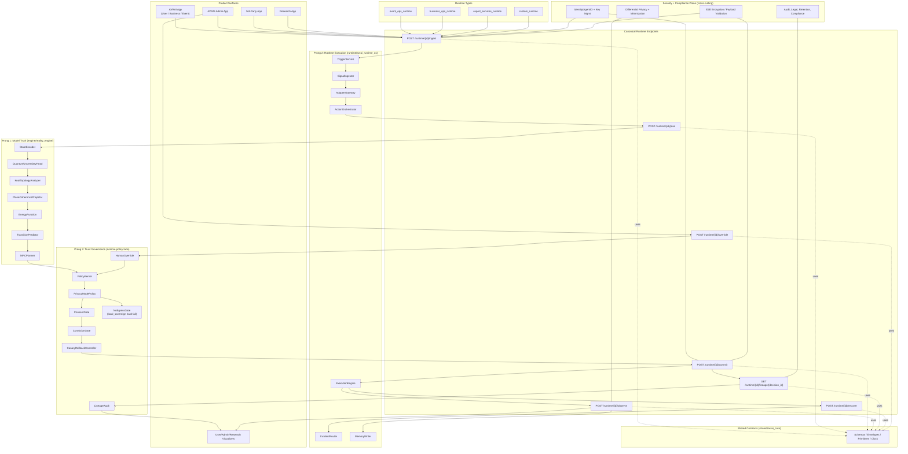

# Ideal Codebase Architecture (3-Prongs + Endpoints + Security)

## Dependency Rule (Non-Negotiable)

1. `apps/* -> runtime/* -> engine/* -> shared/*`
2. No direct `apps/* -> engine/*` imports.
3. No `engine/* -> runtime/*` or `engine/* -> apps/*` imports.
