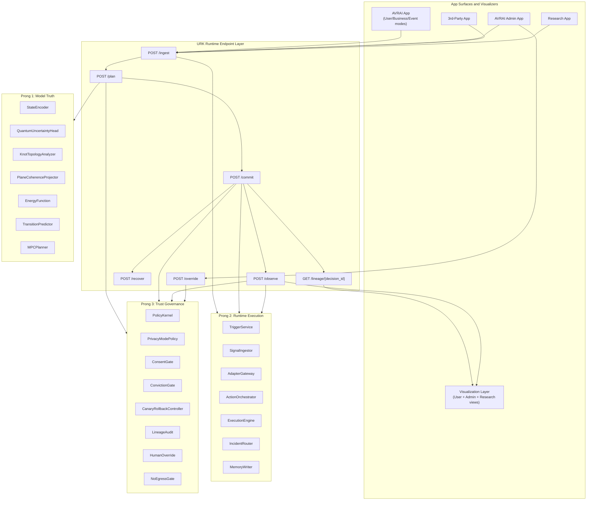
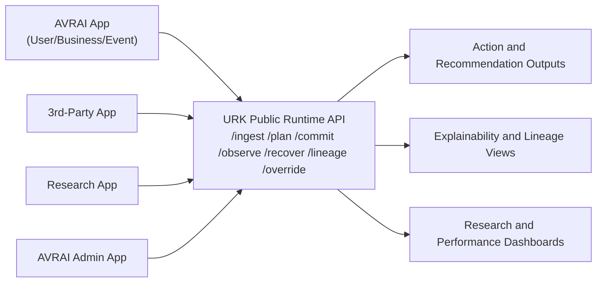
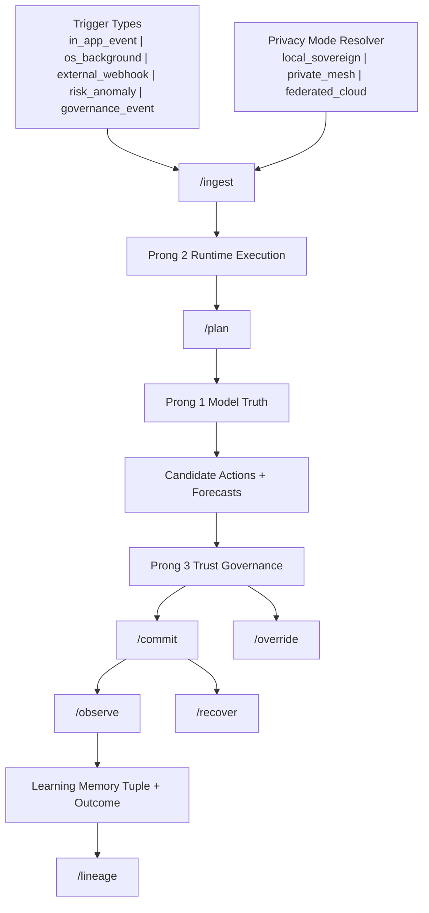
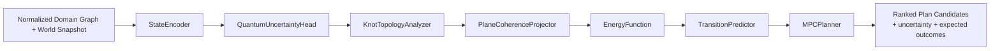
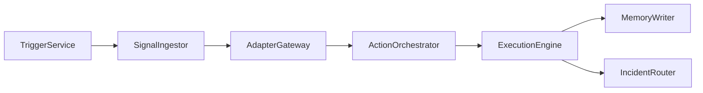
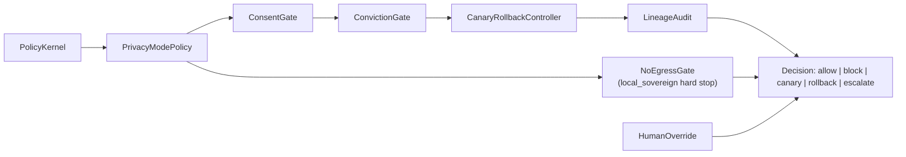
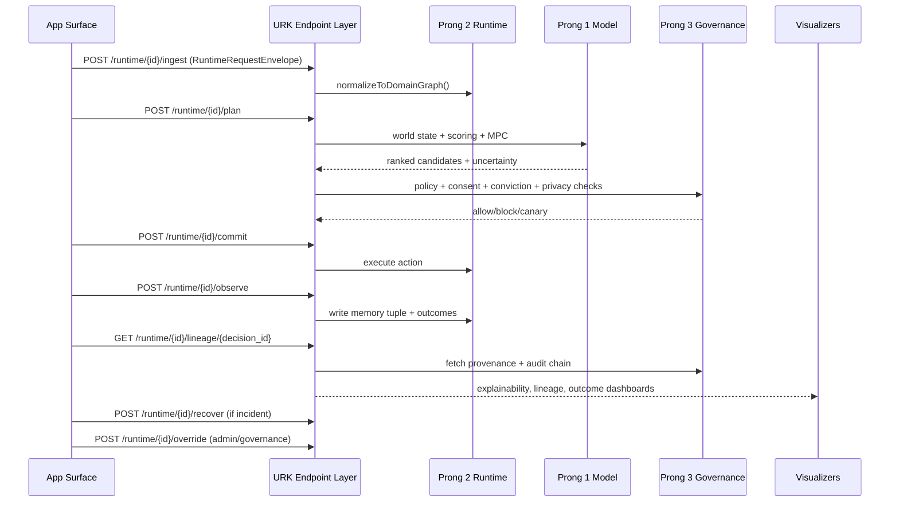
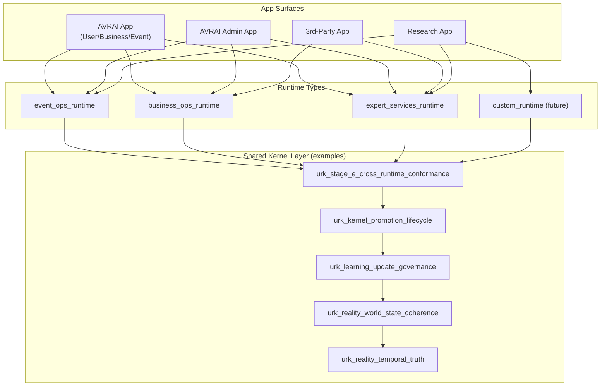
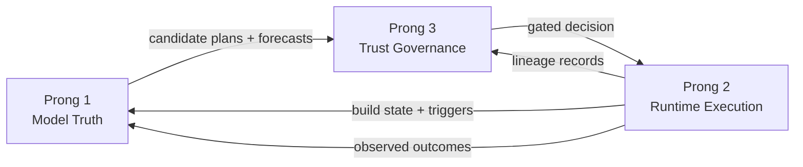

# 3-Prong Architecture Visualization Guide (URK + Endpoints + App Surfaces)

**Date:** February 27, 2026  
**Status:** Canonical visualization addendum  
**Purpose:** Provide a clear visual map for external and internal understanding of AVRAI's 3-prong architecture, kernel model, runtime endpoints, and app surface interactions.

**Primary authorities:**
- `docs/plans/architecture/UNIFIED_RUNTIME_KERNEL_BLUEPRINT_2026-02-27.md`
- `docs/plans/architecture/URK_INTERFACE_CONTRACTS_2026-02-27.md`
- `configs/runtime/kernel_registry.json`

---

## 1. System Map (Top -> Bottom, End-to-End)

---

## 2. External Visualization (What Partners and Product Stakeholders See)

External rule: app surfaces call endpoint contracts; they do not directly call prong internals.

---

## 3. Internal Visualization (How AVRAI Operates Under the Hood)

Internal rule: all production-affecting actions are gated by Prong 3 before commit.

---

## 4. Prong 1 Detail (Model Truth)

---

## 5. Prong 2 Detail (Runtime Execution)

---

## 6. Prong 3 Detail (Trust Governance)

---

## 7. Endpoint Interaction Sequence (Canonical Request Lifecycle)

---

## 8. Runtime and Kernel Coverage by App Surface

---

## 9. How the 3 Prongs Work Together

Operational invariant:
1. Prong 1 proposes,
2. Prong 3 permits or denies,
3. Prong 2 executes and records outcomes,
4. outcome feedback re-enters Prong 1 and Prong 3.

---

## 10. Architecture Visualization Working Guideline (New)

Use this when adding or updating architecture diagrams:

1. Maintain two views for every major subsystem:
   - External view (surfaces + endpoints),
   - Internal view (prongs + kernels + gates).
2. Always represent the seven canonical endpoints: `ingest`, `plan`, `commit`, `observe`, `recover`, `lineage`, `override`.
3. Any action path that can affect users/businesses/events must visually pass through Prong 3 gating.
4. Show privacy mode resolution explicitly in flow diagrams (`local_sovereign`, `private_mesh`, `federated_cloud`).
5. Keep prong boundaries strict:
   - Prong 1 = modeling/planning truth,
   - Prong 2 = orchestration/execution,
   - Prong 3 = policy/trust/governance.
6. Include lineage/explainability outputs in every end-to-end system map.
7. For kernel visuals, distinguish:
   - runtime-scoped kernels (`event/business/expert/custom`),
   - shared governance kernels (`promotion`, `conformance`, `learning governance`).
8. Update references in `ARCHITECTURE_INDEX.md` whenever a new canonical diagram guide is added.

---

## 11. Suggested Diagram Set for Ongoing Operations

1. `System map` (Section 1) for leadership and cross-functional alignment.
2. `External visualization` (Section 2) for product, partners, and API consumers.
3. `Internal visualization` (Section 3) for platform/runtime/ML teams.
4. `Per-prong details` (Sections 4-6) for implementation handoffs.
5. `Endpoint sequence` (Section 7) for integration and QA contract tests.
6. `Runtime-kernel coverage` (Section 8) for governance and rollout planning.
