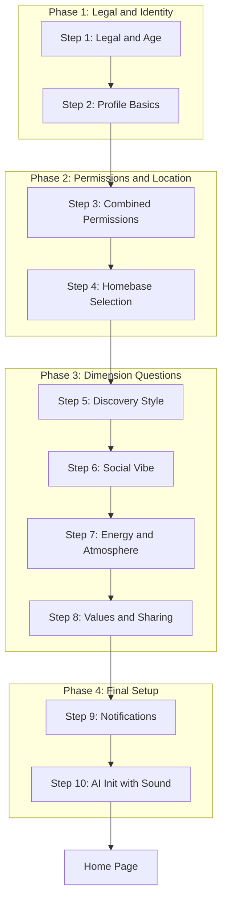

# Onboarding Flow Redesign Implementation Report

**Date:** January 29, 2026  
**Status:** Complete  
**Phase:** Onboarding UX Overhaul

---

## Executive Summary

The onboarding flow was completely redesigned to focus 100% on creating a comprehensive personality profile that feeds into the SPOTS vibe engine. The new flow directly measures all 12 personality dimensions through explicit questions rather than inferring them indirectly from preferences.

Key changes:
- Removed unnecessary steps (welcome tap, favorite places, baseline lists, social media, friends, AI2AI opt-in)
- Added direct dimension-measuring questions (4 steps, 12 questions total)
- Made AI2AI network participation mandatory (no opt-out)
- Enabled unique knot sound playback during AI initialization
- Added all required platform permissions for future features

---

## Architecture

### New Onboarding Flow (10 Steps)



### Step Details

| Step | Name | Content |
|------|------|---------|
| 1 | Legal & Age | Birthday picker (validates 18+), ToS acceptance, Privacy Policy acceptance |
| 2 | Profile Basics | Display name (required), Profile photo (optional, contextual camera permission) |
| 3 | Combined Permissions | Location (REQUIRED), Bluetooth/WiFi for AI2AI (MANDATORY), Background location (RECOMMENDED) |
| 4 | Homebase Selection | Map-based location selection (requires location permission) |
| 5 | Discovery Style | 3 dimension questions |
| 6 | Social Vibe | 3 dimension questions |
| 7 | Energy & Atmosphere | 3 dimension questions |
| 8 | Values & Sharing | 3 dimension questions |
| 9 | Notifications | Optional notification permission |
| 10 | AI Initialization | Knot sound playback + agent creation |

---

## Files Created

### Data Models

| File | Purpose |
|------|---------|
| `lib/core/models/dimension_question.dart` | Question data models including `DimensionQuestion`, `QuestionAnswer`, `SliderConfig`, `DimensionImpact`, `QuestionOption`, `DimensionComputationResult` |

### Services

| File | Purpose |
|------|---------|
| `lib/core/services/onboarding_question_bank.dart` | Contains all 12 dimension questions organized by step |
| `lib/core/services/onboarding_dimension_computer.dart` | Computes dimension values from question answers |

### Onboarding Pages

| File | Step | Dimensions Measured |
|------|------|---------------------|
| `lib/presentation/pages/onboarding/legal_age_page.dart` | 1 | N/A (legal compliance) |
| `lib/presentation/pages/onboarding/profile_basics_page.dart` | 2 | N/A (identity) |
| `lib/presentation/pages/onboarding/combined_permissions_page.dart` | 3 | N/A (permissions) |
| `lib/presentation/pages/onboarding/discovery_style_page.dart` | 5 | exploration_eagerness, novelty_seeking, location_adventurousness |
| `lib/presentation/pages/onboarding/social_vibe_page.dart` | 6 | community_orientation, trust_network_reliance, social_discovery_style |
| `lib/presentation/pages/onboarding/energy_atmosphere_page.dart` | 7 | energy_preference, crowd_tolerance, temporal_flexibility |
| `lib/presentation/pages/onboarding/values_sharing_page.dart` | 8 | value_orientation, authenticity_preference, curation_tendency |
| `lib/presentation/pages/onboarding/notifications_page.dart` | 9 | N/A (notifications) |

### Widgets

| File | Purpose |
|------|---------|
| `lib/presentation/widgets/onboarding/dimension_question_widget.dart` | Reusable UI for slider, choice, and multi-choice questions |

### Tests

| File | Purpose |
|------|---------|
| `test/integration/onboarding/onboarding_flow_dimension_test.dart` | Integration tests for question bank, dimension computer, and answer validation |

---

## Files Modified

### Dimension Mapper Enhancement

**File:** `lib/core/services/onboarding_dimension_mapper.dart`

Added two new methods:
- `computeDimensionsFromAnswers(List<QuestionAnswer> answers)` - Computes all 12 dimensions from direct question answers
- `computeConfidenceFromAnswers(List<QuestionAnswer> answers)` - Computes confidence levels per dimension

The legacy `mapOnboardingToDimensions()` method is preserved for backward compatibility.

### Knot Audio Integration

**File:** `lib/presentation/widgets/knot/knot_audio_loading_widget.dart`

Added polling logic to wait for knot generation:
- Polls up to 30 times with 500ms intervals
- Waits for knot to be available from storage
- Plays unique knot sound once available

**File:** `lib/presentation/pages/onboarding/ai_loading_page.dart`

Changed `enabled: false` to `enabled: true` to activate knot sound playback.

### Platform Permissions

**Android:** `android/app/src/main/AndroidManifest.xml`

```xml
<uses-permission android:name="android.permission.READ_CONTACTS" />
<uses-permission android:name="android.permission.READ_CALENDAR" />
<uses-permission android:name="android.permission.WRITE_CALENDAR" />
<uses-permission android:name="android.permission.ACTIVITY_RECOGNITION" />
```

**iOS:** `ios/Runner/Info.plist`

```xml
<key>NSContactsUsageDescription</key>
<string>avrai uses your contacts to help you find and invite friends...</string>
<key>NSCalendarsUsageDescription</key>
<string>avrai uses your calendar to sync reservations and events...</string>
<key>NSMotionUsageDescription</key>
<string>avrai uses motion data to understand your activity patterns...</string>
```

**macOS:** `macos/Runner/Info.plist`

```xml
<key>NSContactsUsageDescription</key>
<string>avrai uses your contacts to help you find and invite friends...</string>
<key>NSCalendarsUsageDescription</key>
<string>avrai uses your calendar to sync reservations and events...</string>
```

**macOS Entitlements:** `macos/Runner/DebugProfile.entitlements` and `Release.entitlements`

```xml
<key>com.apple.security.device.camera</key>
<true/>
<key>com.apple.security.personal-information.addressbook</key>
<true/>
<key>com.apple.security.personal-information.calendars</key>
<true/>
```

---

## Dimension Coverage

All 12 SPOTS dimensions are now directly measured through onboarding questions:

| Step | Dimensions |
|------|-----------|
| 5 (Discovery) | exploration_eagerness, novelty_seeking, location_adventurousness |
| 6 (Social) | community_orientation, trust_network_reliance, social_discovery_style |
| 7 (Energy) | energy_preference, crowd_tolerance, temporal_flexibility |
| 8 (Values) | value_orientation, authenticity_preference, curation_tendency |

**Total: 12 questions covering all 12 SPOTS dimensions**

---

## Question Design

### Question Types

1. **Slider** - Continuous value from 0.0 to 1.0
   - Used for spectrum-based dimensions
   - Low/high labels indicate extremes
   - Optional intermediate stops

2. **Choice** - Single selection from options
   - Each option maps to specific dimension values
   - Clear, distinct choices

3. **Multi-Choice** - Select up to N options
   - Values from selected options are averaged
   - Used for discovery style preferences

### Example Question Structure

```dart
DimensionQuestion(
  id: 'discovery_5_1',
  prompt: 'When looking for a new place to go...',
  type: QuestionType.choice,
  impacts: [
    DimensionImpact(dimension: 'exploration_eagerness', weight: 1.0),
  ],
  options: [
    QuestionOption(
      id: 'hidden_gems',
      label: 'I love finding hidden gems nobody knows about',
      dimensionValues: {'exploration_eagerness': 0.85},
    ),
    // ... more options
  ],
);
```

### Confidence Calculation

Confidence is computed based on:
- Number of questions measuring each dimension
- Answer clarity (slider values near extremes = higher confidence)
- Consistent answers across related questions

---

## Key Design Decisions

### 1. AI2AI Mandatory (No Opt-Out)

The AI2AI network is now mandatory for all users. The step that previously allowed opting out was removed. Permissions are still requested, but the feature cannot be disabled.

### 2. Direct Dimension Measurement

**Before:** Dimensions were inferred from preferences, places, and friends
- Only 8 of 12 dimensions were indirectly addressed
- Low confidence in inferred values
- Required many user inputs for minimal dimension coverage

**After:** Dimensions are directly measured through questions
- All 12 dimensions explicitly covered
- High confidence from direct answers
- Fewer steps, better results

### 3. Knot Sound During Initialization

The unique knot sound (synthesized from personality topology) now plays during AI initialization:
- Polls for knot availability (may not be generated immediately)
- Syncs with knot animation
- Creates personalized audio experience from first moment

### 4. Contextual Permissions

Permissions are requested contextually:
- Camera permission: Only requested when user taps "add photo"
- Location: Requested before homebase selection (required)
- Notifications: Final optional step (can skip)

---

## Integration Requirements

### To Fully Enable the New Flow

The main `OnboardingPage` (`lib/presentation/pages/onboarding/onboarding_page.dart`) needs to be updated to:

1. Use the new `OnboardingStepType` enum values
2. Import and render the new step pages
3. Collect `QuestionAnswer` lists from dimension pages
4. Use `OnboardingDimensionComputer` to compute final dimensions
5. Pass computed dimensions to `AgentInitializationController`

### Suggested Next Steps

1. Update `OnboardingPage` to integrate new step pages
2. Update `OnboardingData` model to include dimension answers
3. Update `OnboardingFlowController` to use computed dimensions
4. Add analytics for question completion rates
5. A/B test question wording for clarity

---

## Testing

### Unit Tests Covered

- Question bank structure and completeness
- All 12 dimensions are covered by questions
- Unique question IDs
- Valid dimension values (0.0-1.0)
- Dimension computation from answers
- Confidence calculation
- Legacy mapper backward compatibility

### Manual Testing Required

- Permission flows on real iOS/Android/macOS devices
- Knot sound playback during initialization
- Full onboarding flow end-to-end
- Dimension values in personality profile after completion

---

## Summary

The onboarding flow redesign delivers a focused, efficient experience that directly measures all 12 SPOTS personality dimensions. Users complete 12 simple questions across 4 steps, producing a high-confidence personality profile that feeds directly into the quantum vibe engine for immediate personalization.
