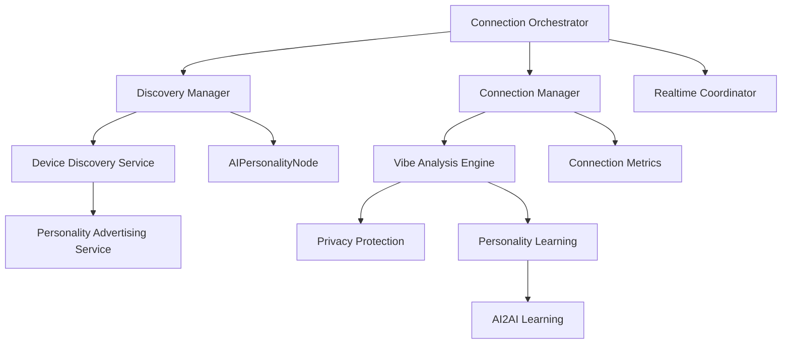

# Component Relationships Diagram

**Created:** December 8, 2025, 5:32 PM CST  
**Purpose:** Visual diagram of component relationships

---

## 📊 **ASCII Diagram**

```
┌─────────────────────────────────────────────────────────────┐
│                  COMPONENT RELATIONSHIPS                     │
└─────────────────────────────────────────────────────────────┘

                    ┌─────────────────────┐
                    │ Connection          │
                    │ Orchestrator        │
                    └──────────┬──────────┘
                               │
                ┌──────────────┼──────────────┐
                │              │              │
        ┌───────▼──────┐ ┌────▼─────┐ ┌─────▼──────┐
        │ Discovery    │ │Connection│ │ Realtime   │
        │ Manager      │ │ Manager  │ │Coordinator │
        └───────┬──────┘ └────┬─────┘ └────────────┘
                │              │
        ┌───────▼──────┐ ┌────▼─────┐
        │ Device       │ │ Vibe     │
        │ Discovery    │ │ Analysis │
        │ Service      │ │ Engine   │
        └───────┬──────┘ └────┬─────┘
                │              │
        ┌───────▼──────┐ ┌────▼─────┐
        │ Personality │ │ Privacy  │
        │ Advertising │ │Protection│
        │ Service     │ │          │
        └─────────────┘ └──────────┘
```

---

## 🔄 **Mermaid Diagram**



---

## 📋 **Component Descriptions**

### **Connection Orchestrator**
- Central orchestrator for all AI2AI connections
- Coordinates discovery, connection, and learning

### **Discovery Manager**
- Handles device discovery
- Manages AI personality discovery
- Prioritizes connections

### **Connection Manager**
- Manages connection lifecycle
- Handles connection establishment
- Monitors connection quality

### **Vibe Analysis Engine**
- Calculates compatibility scores
- Analyzes personality dimensions
- Determines connection types

### **Privacy Protection**
- Anonymizes all data
- Ensures zero personal data exposure
- Validates privacy quality

---

## 🔗 **Related Documentation**

- **Orchestrator:** [`../../03_core_components/ORCHESTRATOR.md`](../../03_core_components/ORCHESTRATOR.md)
- **Discovery Manager:** [`../../03_core_components/DISCOVERY_MANAGER.md`](../../03_core_components/DISCOVERY_MANAGER.md)
- **Connection Manager:** [`../../03_core_components/CONNECTION_MANAGER.md`](../../03_core_components/CONNECTION_MANAGER.md)

---

**Last Updated:** December 8, 2025, 5:32 PM CST

