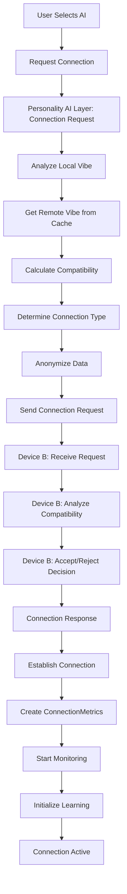

# Connection Establishment Flow Diagram

**Created:** December 8, 2025, 5:32 PM CST  
**Purpose:** Visual diagram of connection establishment flow

---

## 📊 **ASCII Diagram**

```
┌─────────────────────────────────────────────────────────────┐
│              CONNECTION ESTABLISHMENT FLOW                    │
└─────────────────────────────────────────────────────────────┘

Device A                          Personality AI Layer          Device B
────────                          ──────────────────          ─────────
                                   
[User Selects AI]                
      │
      │ 1. Request Connection
      ├───────────────────────────► [Connection Request]
      │                              │
      │                              │ 2. Analyze Local Vibe
      │                              │    - Compile user vibe
      │                              │    - Calculate dimensions
      │                              │
      │                              │ 3. Get Remote Vibe
      │                              │    (from discovery cache)
      │                              │
      │                              │ 4. Calculate Compatibility
      │                              │    - Basic compatibility
      │                              │    - AI pleasure potential
      │                              │    - Learning opportunities
      │                              │
      │                              │ 5. Determine Connection Type
      │                              │    - Deep (0.8+)
      │                              │    - Moderate (0.5-0.8)
      │                              │    - Light (0.2-0.5)
      │                              │    - Surface (0.0-0.2)
      │                              │
      │                              │ 6. Anonymize Data
      │                              │    - Hash personality data
      │                              │    - Add privacy noise
      │                              │    - Create temporal signature
      │                              │
      │                              │ 7. Send Connection Request
      │                              ├───────────────────────────► [Receive Request]
      │                              │                              │
      │                              │                              │ 8. Analyze Compatibility
      │                              │                              │    (on Device B)
      │                              │                              │
      │                              │                              │ 9. Accept/Reject Decision
      │                              │                              │
      │                              │ 10. Connection Response
      │                              │◄──────────────────────────────┘
      │                              │
      │                              │ 11. Establish Connection
      │                              │     - Create ConnectionMetrics
      │                              │     - Start monitoring
      │                              │     - Initialize learning
      │                              │
      │ 12. Connection Established
      │◄──────────────────────────────┘
      │
[Connection Active]
```

---

## 🔄 **Mermaid Diagram**



---

## 📋 **Key Steps**

1. User selects an AI personality to connect with
2. Personality AI Layer analyzes local user's vibe
3. Retrieves remote AI's anonymized vibe from discovery cache
4. Calculates comprehensive compatibility score
5. Determines appropriate connection type based on compatibility
6. Anonymizes all data before transmission
7. Sends connection request to remote device
8. Remote device analyzes compatibility from its perspective
9. Remote device makes accept/reject decision
10. Connection response sent back
11. If accepted, connection established with monitoring and learning
12. Connection active and ready for interactions

---

## 🔗 **Related Documentation**

- **Network Flows:** [`../NETWORK_FLOWS.md`](../NETWORK_FLOWS.md)
- **Connection Manager:** [`../../03_core_components/CONNECTION_MANAGER.md`](../../03_core_components/CONNECTION_MANAGER.md)

---

**Last Updated:** December 8, 2025, 5:32 PM CST

