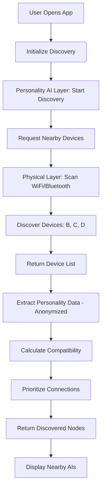

# Device Discovery Flow Diagram

**Created:** December 8, 2025, 5:32 PM CST  
**Purpose:** Visual diagram of device discovery flow

---

## 📊 **ASCII Diagram**

```
┌─────────────────────────────────────────────────────────────┐
│                    DEVICE DISCOVERY FLOW                     │
└─────────────────────────────────────────────────────────────┘

Device A                          Personality AI Layer          Physical Layer
────────                          ──────────────────          ──────────────
                                   
[User Opens App]                  
      │
      │ 1. Initialize Discovery
      ├───────────────────────────► [Start Discovery Process]
      │                              │
      │                              │ 2. Request Nearby Devices
      │                              ├───────────────────────────► [Scan WiFi/Bluetooth]
      │                              │                              │
      │                              │                              │ 3. Discover Devices
      │                              │                              ├─► Device B
      │                              │                              ├─► Device C
      │                              │                              └─► Device D
      │                              │                              │
      │                              │ 4. Return Device List
      │                              │◄──────────────────────────────┘
      │                              │
      │                              │ 5. Extract Personality Data
      │                              │    (Anonymized)
      │                              │
      │                              │ 6. Calculate Compatibility
      │                              │    - Dimension Similarity
      │                              │    - Energy Alignment
      │                              │    - Social Preference
      │                              │
      │                              │ 7. Prioritize Connections
      │                              │    - Sort by compatibility
      │                              │    - Filter by thresholds
      │                              │
      │ 8. Return Discovered Nodes
      │◄──────────────────────────────┘
      │
[Display Nearby AIs]
```

---

## 🔄 **Mermaid Diagram**



---

## 📋 **Key Steps**

1. User opens app or discovery is triggered automatically
2. Personality AI Layer requests device scan from Physical Layer
3. Physical Layer scans for nearby SPOTS-enabled devices
4. Physical Layer returns list of discovered devices
5. Personality AI Layer extracts anonymized personality data from each device
6. Compatibility scores calculated for each discovered device
7. Devices prioritized by compatibility and learning potential
8. Discovered AI personalities returned to application

---

## 🔗 **Related Documentation**

- **Network Flows:** [`../NETWORK_FLOWS.md`](../NETWORK_FLOWS.md)
- **Device Discovery:** [`../../06_network_connectivity/DEVICE_DISCOVERY.md`](../../06_network_connectivity/DEVICE_DISCOVERY.md)

---

**Last Updated:** December 8, 2025, 5:32 PM CST

