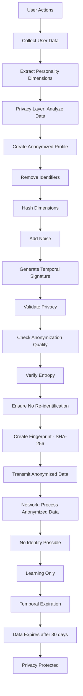

# Privacy Protection Flow Diagram

**Created:** December 8, 2025, 5:32 PM CST  
**Purpose:** Visual diagram of privacy protection flow

---

## 📊 **ASCII Diagram**

```
┌─────────────────────────────────────────────────────────────┐
│                  PRIVACY PROTECTION FLOW                      │
└─────────────────────────────────────────────────────────────┘

User Data                         Privacy Layer                Network
────────                          ────────────                ────────
                                   
[User Actions]                    
      │
      │ 1. Collect User Data
      │    - Actions
      │    - Preferences
      │    - Behavior patterns
      │
      │ 2. Extract Personality Dimensions
      ├───────────────────────────► [Analyze Data]
      │                              │
      │                              │ 3. Create Anonymized Profile
      │                              │    - Remove identifiers
      │                              │    - Hash dimensions
      │                              │    - Add noise
      │                              │
      │                              │ 4. Generate Temporal Signature
      │                              │    - Time-based salt
      │                              │    - Expiration date
      │                              │
      │                              │ 5. Validate Privacy
      │                              │    - Check anonymization quality
      │                              │    - Verify entropy
      │                              │    - Ensure no re-identification
      │                              │
      │                              │ 6. Create Fingerprint
      │                              │    - SHA-256 hash
      │                              │    - No personal data
      │                              │
      │                              │ 7. Transmit Anonymized Data
      │                              ├───────────────────────────► [Network Transmission]
      │                              │                              │
      │                              │                              │ 8. Process Anonymized Data
      │                              │                              │    - No identity possible
      │                              │                              │    - Learning only
      │                              │                              │
      │                              │ 9. Temporal Expiration
      │                              │◄──────────────────────────────┘
      │                              │
      │                              │ 10. Data Expires
      │                              │     (after 30 days)
      │
[Privacy Protected]
```

---

## 🔄 **Mermaid Diagram**



---

## 🔒 **Privacy Guarantees**

- ✅ Zero personal data exposure
- ✅ Anonymous personality fingerprints only
- ✅ No user identification possible
- ✅ Temporal data expiration
- ✅ Differential privacy protection

---

## 🔗 **Related Documentation**

- **Privacy Protection:** [`../../07_privacy_security/PRIVACY_PROTECTION.md`](../../07_privacy_security/PRIVACY_PROTECTION.md)
- **Anonymization:** [`../../07_privacy_security/ANONYMIZATION.md`](../../07_privacy_security/ANONYMIZATION.md)
- **Privacy Flows:** [`../../07_privacy_security/PRIVACY_FLOWS.md`](../../07_privacy_security/PRIVACY_FLOWS.md)

---

**Last Updated:** December 8, 2025, 5:32 PM CST

