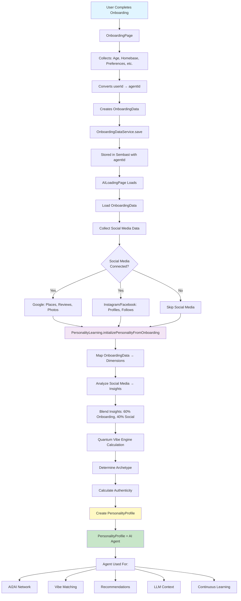
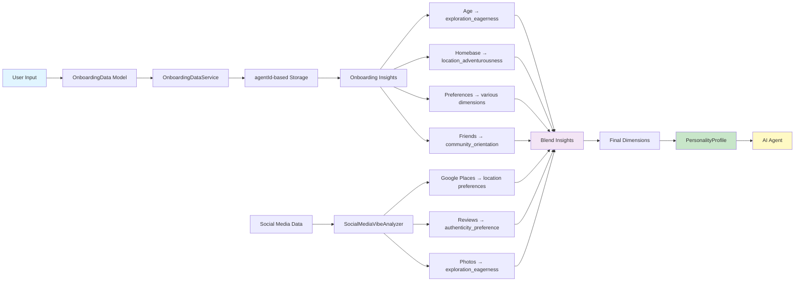
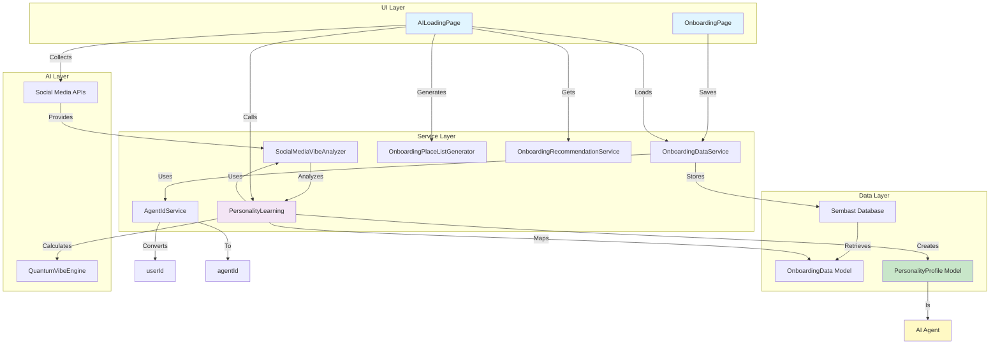
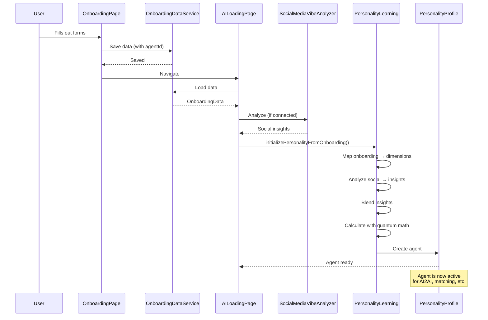
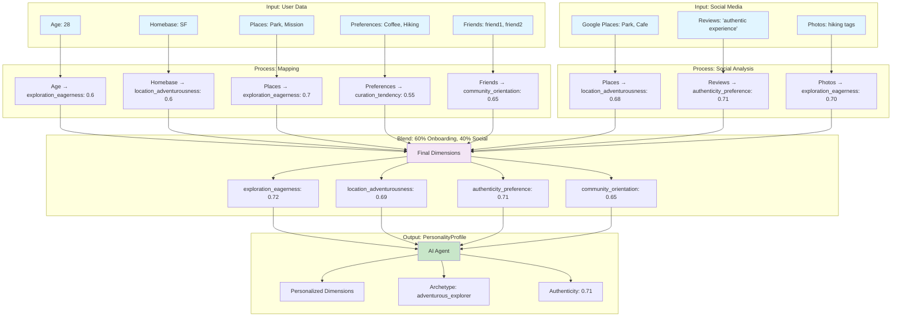
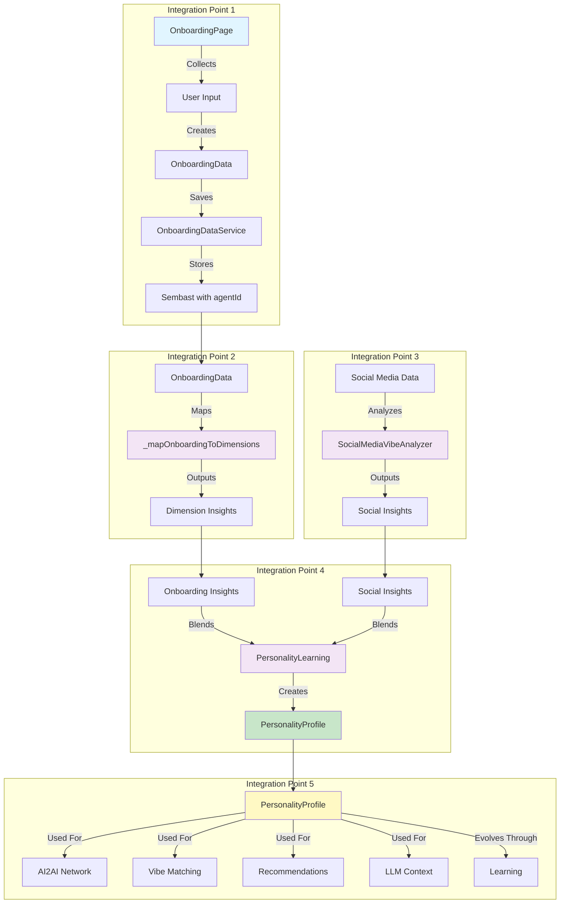
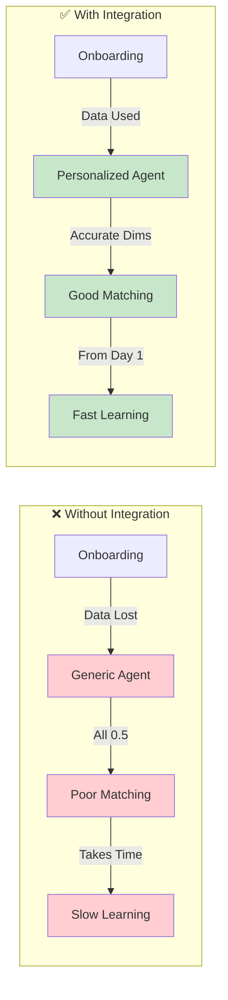

# Onboarding to Agent Generation Flow

**Date:** December 15, 2025  
**Last Updated:** December 23, 2025  
**Status:** ✅ **IMPLEMENTED** (Phases 0-6, 8.3-8.5 complete)  
**Purpose:** Comprehensive explanation of how onboarding, agent generation, and PersonalityProfile work together

---

## 🎯 **CORE CONCEPT**

In SPOTS, the relationship between onboarding, agent generation, and PersonalityProfile is:

- **Onboarding** = Collecting user data (age, preferences, social connections)
- **Agent Generation** = Creating PersonalityProfile from that data
- **PersonalityProfile** = The AI agent itself

They work together in a pipeline: **Onboarding → Data Processing → Agent Generation → PersonalityProfile (Agent) → Agent Usage**

---

## 📊 **VISUAL FLOW DIAGRAM**

### **Complete Pipeline Flow**

**ASCII Art Version (Universal Compatibility):**

```
┌─────────────────────────────────────────────────────────────────┐
│                    USER COMPLETES ONBOARDING                   │
└────────────────────────────┬──────────────────────────────────┘
                             │
                             ▼
                    ┌─────────────────┐
                    │ OnboardingPage │
                    └────────┬───────┘
                             │
                             ▼
        ┌─────────────────────────────────────────┐
        │ Collects: Age, Homebase, Preferences    │
        └──────────────┬──────────────────────────┘
                       │
                       ▼
            ┌──────────────────────┐
            │ Convert userId → agentId │
            └──────────┬───────────┘
                       │
                       ▼
            ┌──────────────────────┐
            │ Create OnboardingData │
            └──────────┬───────────┘
                       │
                       ▼
        ┌───────────────────────────────┐
        │ OnboardingDataService.save()  │
        └──────────────┬────────────────┘
                       │
                       ▼
        ┌───────────────────────────────┐
        │ Stored in Sembast (agentId)  │
        └──────────────┬───────────────┘
                       │
                       ▼
            ┌──────────────────┐
            │ AILoadingPage    │
            │ Loads Data      │
            └────────┬─────────┘
                     │
                     ▼
        ┌────────────────────────────┐
        │ Load OnboardingData        │
        └────────────┬───────────────┘
                     │
                     ▼
        ┌────────────────────────────┐
        │ Collect Social Media Data │
        └────────────┬──────────────┘
                     │
                     ▼
            ┌──────────────┐
            │ Social Media │
            │ Connected?   │
            └───┬──────┬────┘
                │      │
         ┌──────┘      └──────┐
         │ Yes                  │ No
         ▼                      ▼
┌─────────────────┐    ┌──────────────┐
│ Google: Places, │    │ Skip Social  │
│ Reviews, Photos │    │ Media        │
└────────┬────────┘    └──────┬──────┘
         │                     │
         └──────────┬──────────┘
                    │
                    ▼
    ┌───────────────────────────────────────────────┐
    │ PersonalityLearning.initializePersonality... │
    └──────────────────────┬───────────────────────┘
                           │
                           ▼
            ┌──────────────────────────────┐
            │ Map OnboardingData → Dimensions │
            └──────────────┬───────────────┘
                           │
                           ▼
        ┌──────────────────────────────────┐
        │ Analyze Social Media → Insights │
        └──────────────┬──────────────────┘
                       │
                       ▼
    ┌──────────────────────────────────────────┐
    │ Blend Insights: 60% Onboarding, 40% Social │
    └──────────────┬───────────────────────────┘
                   │
                   ▼
    ┌──────────────────────────────────┐
    │ Quantum Vibe Engine Calculation │
    │ Patent #1: Quantum Compatibility  │
    │ C = |⟨ψ_A|ψ_B⟩|²                  │
    └──────────────┬───────────────────┘
                   │
                   ▼
            ┌──────────────────┐
            │ Determine Archetype │
            └──────────┬───────┘
                       │
                       ▼
            ┌──────────────────┐
            │ Calculate Authenticity │
            └──────────┬───────┘
                       │
                       ▼
        ┌───────────────────────────┐
        │ Create PersonalityProfile  │
        └──────────────┬────────────┘
                       │
                       ▼
    ┌───────────────────────────────────┐
    │ PersonalityProfile = AI Agent ✅  │
    └──────────────┬────────────────────┘
                   │
                   ▼
        ┌──────────────────────┐
        │ Agent Used For:     │
        ├─────────────────────┤
        │ • AI2AI Network     │
        │ • Vibe Matching     │
        │ • Recommendations   │
        │ • LLM Context       │
        │ • Continuous Learning│
        └─────────────────────┘
```

**Mermaid Version (For viewers that support it):**



---

### **Data Transformation Flow**

**ASCII Art Version (Universal Compatibility):**

```
┌─────────────────────────────────────────────────────────────────┐
│                         USER INPUT                              │
│  Age, Homebase, Places, Preferences, Friends, Social Media     │
└────────────────────────────┬──────────────────────────────────┘
                             │
                             ▼
                    ┌──────────────────┐
                    │ OnboardingData   │
                    │ Model           │
                    └────────┬────────┘
                             │
                             ▼
            ┌─────────────────────────────┐
            │ OnboardingDataService       │
            └────────────┬────────────────┘
                         │
                         ▼
        ┌───────────────────────────────┐
        │ agentId-based Storage        │
        │ (Sembast)                    │
        └───────────────┬──────────────┘
                        │
        ┌───────────────┴───────────────┐
        │                               │
        ▼                               ▼
┌──────────────────┐          ┌────────────────────┐
│ Onboarding       │          │ Social Media Data  │
│ Insights         │          │ (Google, IG, etc.) │
└────────┬─────────┘          └──────────┬─────────┘
         │                               │
         │                               ▼
         │                   ┌───────────────────────┐
         │                   │ SocialMediaVibeAnalyzer│
         │                   └──────────┬──────────────┘
         │                              │
         │                              │
         ▼                              ▼
┌────────────────────┐         ┌──────────────────────┐
│ Age →              │         │ Google Places →       │
│   exploration_     │         │   location_prefs      │
│   eagerness        │         │                       │
├────────────────────┤         ├──────────────────────┤
│ Homebase →         │         │ Reviews →             │
│   location_        │         │   authenticity_pref   │
│   adventurousness  │         │                       │
├────────────────────┤         ├──────────────────────┤
│ Preferences →      │         │ Photos →              │
│   various dims     │         │   exploration_eager   │
├────────────────────┤         └──────────────────────┘
│ Friends →          │
│   community_       │
│   orientation      │
└─────────┬──────────┘
          │
          │         ┌──────────────┐
          └─────────┤              │
                    │ Blend Insights│
                    │ 60% Onboarding│
                    │ 40% Social    │
                    └───────┬───────┘
                            │
                            ▼
                ┌───────────────────────┐
                │ Final Dimensions       │
                │ (12 personality dims)  │
                └───────────┬─────────────┘
                            │
                            ▼
                ┌───────────────────────┐
                │ PersonalityProfile    │
                └───────────┬───────────┘
                            │
                            ▼
                    ┌──────────────┐
                    │ AI Agent ✅  │
                    └──────────────┘
```

**Mermaid Version (For viewers that support it):**



---

### **Component Interaction Diagram**

**ASCII Art Version (Universal Compatibility):**

```
┌─────────────────────────────────────────────────────────────────┐
│                         UI LAYER                                │
├─────────────────────────────────────────────────────────────────┤
│                                                                 │
│  ┌─────────────────┐         ┌──────────────────┐              │
│  │ OnboardingPage  │         │  AILoadingPage   │              │
│  └────────┬────────┘         └────────┬─────────┘              │
│           │                           │                         │
│           │ Saves                     │ Loads                  │
│           │                           │                        │
└───────────┼───────────────────────────┼────────────────────────┘
            │                           │
            ▼                           ▼
┌─────────────────────────────────────────────────────────────────┐
│                      SERVICE LAYER                              │
├─────────────────────────────────────────────────────────────────┤
│                                                                 │
│  ┌──────────────────────┐    ┌──────────────────────┐        │
│  │ OnboardingDataService│    │  AgentIdService       │        │
│  │                      │    │  userId → agentId     │        │
│  └──────────┬───────────┘    └──────────────────────┘        │
│             │                                                  │
│             │ Stores                                           │
│             │                                                  │
│  ┌──────────┴───────────┐    ┌──────────────────────┐        │
│  │ Sembast Database     │    │ SocialMediaVibe      │        │
│  │                      │    │ Analyzer             │        │
│  └──────────┬───────────┘    └──────────┬───────────┘        │
│             │                           │                     │
│             │ Retrieves                  │ Analyzes           │
│             │                           │                     │
│  ┌──────────┴───────────┐    ┌──────────┴───────────┐        │
│  │ OnboardingData Model  │    │ PersonalityLearning  │        │
│  └──────────────────────┘    └──────────┬───────────┘        │
│                                          │                     │
│                                          │ Creates             │
│                                          │                     │
└──────────────────────────────────────────┼─────────────────────┘
                                           │
                                           ▼
┌─────────────────────────────────────────────────────────────────┐
│                        DATA LAYER                               │
├─────────────────────────────────────────────────────────────────┤
│                                                                 │
│  ┌──────────────────────────────┐                             │
│  │ PersonalityProfile Model     │                             │
│  │                              │                             │
│  │  • dimensions (12 values)    │                             │
│  │  • archetype                 │                             │
│  │  • authenticity               │                             │
│  │  • agentId                    │                             │
│  └──────────────┬───────────────┘                             │
│                 │                                              │
│                 │ IS                                           │
│                 │                                              │
└─────────────────┼──────────────────────────────────────────────┘
                  │
                  ▼
        ┌──────────────────┐
        │   AI AGENT ✅    │
        │                  │
        │ Used for:        │
        │ • AI2AI Network  │
        │ • Vibe Matching  │
        │ • Recommendations│
        │ • LLM Context    │
        └──────────────────┘

┌─────────────────────────────────────────────────────────────────┐
│                        AI LAYER                                 │
├─────────────────────────────────────────────────────────────────┤
│                                                                 │
│  ┌──────────────────────┐    ┌──────────────────────┐        │
│  │ QuantumVibeEngine     │    │ Social Media APIs    │        │
│  │                      │    │ (Google, IG, etc.)    │        │
│  └──────────────────────┘    └──────────────────────┘        │
│                                                                 │
└─────────────────────────────────────────────────────────────────┘
```

**Mermaid Version (For viewers that support it):**



---

## 📊 **CURRENT STATE vs TARGET STATE**

### **Current State (Fixed) ✅**

```
OnboardingPage collects data
  ↓
Saves to OnboardingDataService (using agentId) ✅
  ↓
AILoadingPage loads onboarding data ✅
  ↓
Collects social media data (if connected) ✅
  ↓
Calls initializePersonalityFromOnboarding() with data ✅
  ↓
Maps onboarding data to personality dimensions ✅
  ↓
Analyzes social media for additional insights ✅
  ↓
Blends insights using quantum math ✅
  ↓
Creates PersonalityProfile with personalized dimensions ✅
  ↓
Agent created with accurate initial personality ✅
```

**Implementation Status:**
- ✅ Onboarding data collected and saved with agentId
- ✅ Agent starts with personalized values (from onboarding + social media)
- ✅ User's preferences reflected immediately
- ✅ Good initial matching and recommendations
- ✅ PersonalityProfile uses agentId (not userId) for privacy
- ✅ Quantum Vibe Engine integrated
- ✅ Social media data collection implemented
- ✅ Place list generator integrated with Google Places API

---

### **Implementation Complete ✅** (December 23, 2025)

**Completed Phases:**
- ✅ **Phase 0:** AILoadingPage navigation restored
- ✅ **Phase 1:** Baseline lists integration
- ✅ **Phase 2:** Social media data collection (OAuth + APIs)
- ✅ **Phase 3:** PersonalityProfile agentId migration
- ✅ **Phase 4:** Quantum Vibe Engine (already complete)
- ✅ **Phase 5:** Place list generator integration
- ✅ **Phase 6:** Testing & validation (5/5 contract tests, 4/4 flow tests)

**Benefits Achieved:**
- ✅ Agent starts personalized from day one
- ✅ User's preferences reflected immediately
- ✅ Better initial matching and recommendations
- ✅ Agent is accurate from the start
- ✅ Privacy-protected (agentId throughout)
- ✅ Real social media data collection
- ✅ Quantum-powered personality calculation

---

## 🔄 **COMPLETE DATA FLOW**

### **Visual: Complete Flow Overview**

**ASCII Art Version (Universal Compatibility):**

```
┌─────────────────────────────────────────────────────────────────┐
│                    SEQUENCE DIAGRAM                            │
└─────────────────────────────────────────────────────────────────┘

User
 │
 │ Fills out forms
 │
 ▼
OnboardingPage
 │
 │ Save data (with agentId)
 │
 ▼
OnboardingDataService ────────┐
 │                              │
 │ Saved                        │
 │                              │
 │◄─────────────────────────────┘
 │
 │ Navigate
 │
 ▼
AILoadingPage
 │
 │ Load data
 │
 ▼
OnboardingDataService ────────┐
 │                              │
 │ OnboardingData               │
 │                              │
 │◄─────────────────────────────┘
 │
 │ Analyze (if connected)
 │
 ▼
SocialMediaVibeAnalyzer ──────┐
 │                              │
 │ Social insights              │
 │                              │
 │◄─────────────────────────────┘
 │
 │ initializePersonalityFromOnboarding()
 │
 ▼
PersonalityLearning
 │
 │ Map onboarding → dimensions
 │ Analyze social → insights
 │ Blend insights
 │ Calculate with quantum math
 │
 │ Create agent
 │
 ▼
PersonalityProfile ────────────┐
 │                              │
 │ Agent ready                  │
 │                              │
 │◄─────────────────────────────┘
 │
 │ Agent is now active for:
 │ • AI2AI network
 │ • Vibe matching
 │ • Recommendations
 │
```

**Mermaid Version (For viewers that support it):**



---

### **Phase 1: Onboarding Data Collection**

```
┌─────────────────────────────────────────────────────────────┐
│                    ONBOARDING PHASE                         │
│                                                             │
│  OnboardingPage                                             │
│  ├─ Collects: age, homebase, favorite places, preferences  │
│  ├─ Tracks: social media connections                       │
│  ├─ Converts: userId → agentId (for privacy)              │
│  └─ Saves: OnboardingDataService                           │
└────────────────────┬────────────────────────────────────────┘
                     │
                     │ OnboardingData persisted (agentId-based)
                     ▼
```

**What Happens:**
1. User fills out onboarding forms (age, homebase, preferences, etc.)
2. System tracks which social media platforms are connected
3. System converts `userId` → `agentId` for privacy protection
4. Creates `OnboardingData` model with `agentId`
5. Saves to `OnboardingDataService` (stored in Sembast using `agentId` as key)

**Data Collected:**
- Age and birthday
- Homebase (primary location)
- Favorite places
- Preferences (Food & Drink, Activities, Outdoor & Nature, etc.)
- Baseline lists
- Respected friends
- Social media connection status (Google, Instagram, Facebook, Twitter)

---

### **Phase 2: Agent Initialization**

```
┌─────────────────────────────────────────────────────────────┐
│                    AGENT INITIALIZATION                      │
│                                                             │
│  AILoadingPage                                              │
│  ├─ Loads: OnboardingData from service                     │
│  ├─ Collects: Social media profiles, follows, connections │
│  ├─ Generates: Place lists from Google Maps                │
│  ├─ Gets: Recommendations (lists and accounts)            │
│  └─ Calls: initializePersonalityFromOnboarding()          │
│                                                             │
│  PersonalityLearning                                        │
│  ├─ Maps: OnboardingData → dimension values                │
│  ├─ Analyzes: SocialMediaVibeAnalyzer → insights          │
│  ├─ Calculates: QuantumVibeEngine → final dimensions       │
│  └─ Creates: PersonalityProfile with personalized dims     │
└────────────────────┬────────────────────────────────────────┘
                     │
                     │ Personalized PersonalityProfile
                     ▼
```

**What Happens:**
1. `AILoadingPage` loads `OnboardingData` from service
2. Collects social media data (if user connected accounts)
   - Google: saved places, reviews, photos
   - Instagram/Facebook/Twitter: profiles, follows, connections
3. Generates personalized place lists using Google Maps Places API
4. Gets recommendations for lists and accounts to follow
5. Calls `PersonalityLearning.initializePersonalityFromOnboarding()`
6. System processes all data to create personalized agent

---

### **Phase 3: Personality Profile Creation (The Agent)**

```
┌─────────────────────────────────────────────────────────────┐
│                    PERSONALITY PROFILE (AGENT)               │
│                                                             │
│  PersonalityProfile                                         │
│  ├─ agentId: "agent_abc123..." (privacy-protected)         │
│  ├─ dimensions: {                                          │
│  │     'exploration_eagerness': 0.72,  // Personalized    │
│  │     'location_adventurousness': 0.69, // Personalized  │
│  │     ... (12 total dimensions)                           │
│  │   }                                                      │
│  ├─ dimensionConfidence: {                                 │
│  │     'exploration_eagerness': 0.3,  // From onboarding  │
│  │     ... (confidence from data sources)                  │
│  │   }                                                      │
│  ├─ archetype: "adventurous_explorer"  // Calculated      │
│  ├─ authenticity: 0.71                  // Calculated      │
│  ├─ evolutionGeneration: 1                                │
│  └─ learningHistory: {                                     │
│        'onboarding_data_used': true,                       │
│        'social_media_data_used': true,                      │
│        'learning_sources': ['onboarding', 'social_media'], │
│        'agent_id': agentId,                                 │
│      }                                                      │
│                                                             │
│  ✅ This IS the AI Agent                                    │
└────────────────────┬────────────────────────────────────────┘
                     │
                     │ Agent ready for use
                     ▼
```

**What Happens:**
1. System converts `userId` → `agentId` for privacy
2. Maps onboarding data to personality dimensions
3. Analyzes social media data for additional insights
4. Blends insights (60% onboarding, 40% social media)
5. Uses quantum math for final dimension calculations
6. Determines archetype from dimensions
7. Calculates initial authenticity score
8. Creates `PersonalityProfile` with personalized values
9. **This PersonalityProfile IS the AI agent**

---

### **Phase 4: Agent Usage**

```
┌─────────────────────────────────────────────────────────────┐
│                    AGENT USAGE                               │
│                                                             │
│  The PersonalityProfile (agent) is now used for:            │
│  ├─ AI2AI network participation                            │
│  ├─ Vibe analysis and matching                              │
│  ├─ Recommendations (spots, lists, accounts)              │
│  ├─ LLM context (personality-aware responses)             │
│  └─ Continuous learning and evolution                      │
└─────────────────────────────────────────────────────────────┘
```

**What Happens:**
- Agent participates in AI2AI network (anonymous communication)
- Agent used for vibe-based matching with other users
- Agent provides context for LLM responses
- Agent evolves through learning from interactions

---

## 🔄 **DATA TRANSFORMATION AT EACH STEP**

### **Visual: Data Transformation Pipeline**

**ASCII Art Version (Universal Compatibility):**

```
┌─────────────────────────────────────────────────────────────────┐
│                    INPUT: USER DATA                             │
├─────────────────────────────────────────────────────────────────┤
│                                                                 │
│  Age: 28                                                        │
│  Homebase: San Francisco                                        │
│  Places: Golden Gate Park, Mission District                     │
│  Preferences: Coffee, Craft Beer, Hiking, Live Music             │
│  Friends: friend1, friend2                                      │
│                                                                 │
└───────────────────────┬─────────────────────────────────────────┘
                        │
                        ▼
        ┌───────────────────────────────────────┐
        │         PROCESS: MAPPING              │
        ├───────────────────────────────────────┤
        │                                       │
        │  Age: 28                              │
        │    → exploration_eagerness: 0.6       │
        │    → temporal_flexibility: 0.65       │
        │                                       │
        │  Homebase: SF                          │
        │    → location_adventurousness: 0.6     │
        │                                       │
        │  Places: Park, Mission                  │
        │    → exploration_eagerness: 0.7       │
        │    → location_adventurousness: 0.65   │
        │                                       │
        │  Preferences: Coffee, Hiking           │
        │    → curation_tendency: 0.55          │
        │    → authenticity_preference: 0.53    │
        │                                       │
        │  Friends: friend1, friend2            │
        │    → community_orientation: 0.65     │
        │    → trust_network_reliance: 0.58     │
        │                                       │
        └───────────────────┬───────────────────┘
                            │
                            │
┌───────────────────────────┴───────────────────────────────────────┐
│                    INPUT: SOCIAL MEDIA                           │
├───────────────────────────────────────────────────────────────────┤
│                                                                   │
│  Google Places: Dolores Park, Blue Bottle Coffee                  │
│  Reviews: "Amazing authentic experience"                         │
│  Photos: Yosemite (tags: nature, hiking)                         │
│                                                                   │
└───────────────────────────┬───────────────────────────────────────┘
                            │
                            ▼
        ┌───────────────────────────────────────┐
        │    PROCESS: SOCIAL ANALYSIS           │
        ├───────────────────────────────────────┤
        │                                       │
        │  Google Places: Park, Cafe             │
        │    → location_adventurousness: 0.68   │
        │    → exploration_eagerness: 0.65      │
        │                                       │
        │  Reviews: "authentic experience"       │
        │    → authenticity_preference: 0.71    │
        │                                       │
        │  Photos: hiking tags                   │
        │    → exploration_eagerness: 0.70      │
        │    → location_adventurousness: 0.68   │
        │                                       │
        └───────────────────┬───────────────────┘
                            │
                            │
        ┌───────────────────┴───────────────────┐
        │   BLEND: 60% Onboarding, 40% Social   │
        ├───────────────────────────────────────┤
        │                                       │
        │  Final Dimensions:                    │
        │    • exploration_eagerness: 0.72      │
        │    • location_adventurousness: 0.69   │
        │    • authenticity_preference: 0.71    │
        │    • community_orientation: 0.65     │
        │    • curation_tendency: 0.55          │
        │    • trust_network_reliance: 0.58     │
        │    • ... (12 total dimensions)       │
        │                                       │
        └───────────────────┬───────────────────┘
                            │
                            ▼
        ┌───────────────────────────────────────┐
        │   OUTPUT: PERSONALITY PROFILE        │
        ├───────────────────────────────────────┤
        │                                       │
        │  AI Agent ✅                           │
        │                                       │
        │  • Personalized Dimensions            │
        │  • Archetype: adventurous_explorer     │
        │  • Authenticity: 0.71                  │
        │  • agentId: "agent_abc123..."         │
        │                                       │
        └───────────────────────────────────────┘
```

**Mermaid Version (For viewers that support it):**



---

### **Step 1: Onboarding → OnboardingData**

**Input (from UI):**
```dart
// User fills out onboarding forms
age: 28
homebase: "San Francisco, CA"
favoritePlaces: ["Golden Gate Park", "Mission District"]
preferences: {
  "Food & Drink": ["Coffee", "Craft Beer"],
  "Activities": ["Hiking", "Live Music"],
  "Outdoor & Nature": ["Parks", "Beaches"]
}
respectedFriends: ["friend1", "friend2"]
socialMediaConnected: {"google": true, "instagram": false}
```

**Process:**
```dart
// Convert userId → agentId
final agentId = await agentIdService.getUserAgentId(userId);

// Create OnboardingData
final onboardingData = OnboardingData(
  agentId: agentId, // ✅ Privacy-protected
  age: 28,
  homebase: "San Francisco, CA",
  favoritePlaces: ["Golden Gate Park", "Mission District"],
  preferences: {...},
  respectedFriends: ["friend1", "friend2"],
  socialMediaConnected: {"google": true, "instagram": false},
  completedAt: DateTime.now(),
);

// Save to service
await onboardingService.saveOnboardingData(userId, onboardingData);
```

**Output (OnboardingData model):**
- Structured data with `agentId` (not `userId`)
- Stored in Sembast using `agentId` as key
- Ready for retrieval during agent initialization

---

### **Step 2: OnboardingData → Dimension Insights**

**Input (OnboardingData):**
```dart
onboardingData = {
  'age': 28,
  'homebase': 'San Francisco, CA',
  'favoritePlaces': ['Golden Gate Park', 'Mission District'],
  'preferences': {
    'Food & Drink': ['Coffee', 'Craft Beer'],
    'Activities': ['Hiking', 'Live Music'],
    'Outdoor & Nature': ['Parks', 'Beaches']
  },
  'respectedFriends': ['friend1', 'friend2']
}
```

**Process (_mapOnboardingToDimensions):**
```dart
// Patent #12: Multi-Path Dynamic Expertise System
// Baseline lists seed expertise paths (Exploration, Credentials, Influence, Professional, Community, Local)

// Age analysis
if (age == 28) {
  // Young adult → higher exploration
  insights['exploration_eagerness'] = 0.6;
  insights['temporal_flexibility'] = 0.65;
}

// Homebase analysis
if (homebase == 'San Francisco, CA') {
  // Urban area → location adventurousness
  insights['location_adventurousness'] = 0.6;
}

// Favorite places analysis
if (favoritePlaces.length > 1) {
  // Multiple places → exploration
  insights['exploration_eagerness'] = 0.7;
  insights['location_adventurousness'] = 0.65;
}

// Preferences analysis
if (preferences['Food & Drink'].isNotEmpty) {
  // Food interest → curation tendency
  insights['curation_tendency'] = 0.55;
  insights['authenticity_preference'] = 0.53;
}

if (preferences['Activities'].contains('Hiking')) {
  // Outdoor activity → exploration
  insights['exploration_eagerness'] = 0.72;
  insights['location_adventurousness'] = 0.68;
}

if (preferences['Outdoor & Nature'].isNotEmpty) {
  // Nature interest → location adventurousness
  insights['location_adventurousness'] = 0.7;
  insights['exploration_eagerness'] = 0.68;
}

// Friends analysis
if (respectedFriends.isNotEmpty) {
  // Has respected friends → community orientation
  insights['community_orientation'] = 0.65;
  insights['trust_network_reliance'] = 0.58;
}
```

**Output (Dimension Insights):**
```dart
onboardingInsights = {
  'exploration_eagerness': 0.72,
  'temporal_flexibility': 0.65,
  'location_adventurousness': 0.70,
  'curation_tendency': 0.55,
  'authenticity_preference': 0.53,
  'community_orientation': 0.65,
  'trust_network_reliance': 0.58,
  // ... other dimensions
}
```

---

### **Step 3: Social Media Data → Dimension Insights**

**Input (Social Media Data):**
```dart
socialMediaData = {
  'platform': 'google',
  'profile': {...},
  'googleSavedPlaces': [
    {'name': 'Dolores Park', 'type': 'park'},
    {'name': 'Blue Bottle Coffee', 'type': 'cafe'},
  ],
  'googleReviews': [
    {'rating': 5, 'text': 'Amazing authentic experience'},
    {'rating': 4, 'text': 'Great local spot'},
  ],
  'googlePhotos': [
    {'location': 'Yosemite', 'tags': ['nature', 'hiking']},
  ],
  'follows': [...],
  'connections': [...]
}
```

**Process (SocialMediaVibeAnalyzer):**
```dart
// Google saved places analysis
if (savedPlaces.contains('park')) {
  insights['location_adventurousness'] = 0.68;
  insights['exploration_eagerness'] = 0.65;
}

// Google reviews analysis
if (reviews.any(r => r.text.contains('authentic'))) {
  insights['authenticity_preference'] = 0.71;
}

// Google photos analysis
if (photos.any(p => p.tags.contains('hiking'))) {
  insights['exploration_eagerness'] = 0.70;
  insights['location_adventurousness'] = 0.68;
}

// Profile content analysis
// Follows/connections analysis
// ... more analysis
```

**Output (Social Media Insights):**
```dart
socialInsights = {
  'location_adventurousness': 0.68,
  'exploration_eagerness': 0.70,
  'authenticity_preference': 0.71,
  // ... other dimensions
}
```

---

### **Step 4: Blend Insights → Final Dimensions**

**Patent Reference:** Patent #1 - Quantum Compatibility Calculation System ⭐⭐⭐⭐⭐ (Tier 1)

**Quantum Vibe Engine Calculation:**
- **Compatibility Formula:** `C = |⟨ψ_A|ψ_B⟩|²`
  - `C` = Compatibility score (0.0 to 1.0)
  - `|ψ_A⟩` = Quantum state vector for personality A
  - `|ψ_B⟩` = Quantum state vector for personality B
  - `⟨ψ_A|ψ_B⟩` = Quantum inner product (bra-ket notation)
  - `|...|²` = Probability amplitude squared (quantum measurement)
- **Bures Distance:** `D_B = √[2(1 - |⟨ψ_A|ψ_B⟩|)]` (quantum distance metric)
- **Entanglement:** `|ψ_entangled⟩ = |ψ_energy⟩ ⊗ |ψ_exploration⟩` (entangled dimensions)
- **Blend Ratio:** 70% quantum dimensions + 30% onboarding dimensions

**Mathematical Proofs (Patent #1):**
- ✅ **3 theorems + 1 corollary** (documented in patent)
- Theorem 1: Quantum Inner Product Properties
- Theorem 2: Bures Distance Metric Properties
- Theorem 3: Entanglement Impact on Compatibility
- Corollary 1: Quantum Regularization Effectiveness

**Process (Blending):**
```dart
// Start with default (0.5)
initialDimensions = {
  'exploration_eagerness': 0.5,
  'location_adventurousness': 0.5,
  // ... all 0.5
}

// Apply onboarding (60% weight)
onboardingInsights.forEach((dimension, value) {
  initialDimensions[dimension] = 
      (0.5 * 0.4 + value * 0.6).clamp(0.0, 1.0);
});

// Apply social media (40% weight on existing)
socialInsights.forEach((dimension, value) {
  final existing = initialDimensions[dimension] ?? 0.5;
  initialDimensions[dimension] = 
      (existing * 0.6 + value * 0.4).clamp(0.0, 1.0);
});
```

**Output (Final Dimensions):**
```dart
finalDimensions = {
  'exploration_eagerness': 0.72,      // High (from onboarding + social)
  'location_adventurousness': 0.69,    // High (from homebase + places)
  'temporal_flexibility': 0.65,        // Medium-High (from age)
  'authenticity_preference': 0.71,     // High (from reviews)
  'community_orientation': 0.65,       // Medium-High (from friends)
  'curation_tendency': 0.55,           // Medium (from food preferences)
  'trust_network_reliance': 0.58,      // Medium (from friends)
  // ... other dimensions
}
```

---

### **Step 5: Dimensions → PersonalityProfile (Agent)**

**Input (Final Dimensions):**
```dart
finalDimensions = {
  'exploration_eagerness': 0.72,
  'location_adventurousness': 0.69,
  // ... all 12 dimensions
}
```

**Process (Create PersonalityProfile):**
```dart
// Patent #1: Quantum Vibe Engine calculation
// Compatibility: C = |⟨ψ_A|ψ_B⟩|²
// Quantum dimensions blended 70% with onboarding 30%

// Determine archetype from dimensions
archetype = _determineArchetypeFromDimensions(finalDimensions);
// Result: "adventurous_explorer" (exploration >= 0.8, energy >= 0.7)

// Calculate authenticity
authenticity = _calculateInitialAuthenticity(finalDimensions, onboardingData);
// Result: 0.71 (from authenticity_preference + preferences)

// Create PersonalityProfile
// Patent #3: Contextual Personality System with Drift Resistance
// Core personality with maxDrift = 0.1836 (18.36% drift limit)
// ✅ IMPLEMENTED: Uses agentId (not userId) for privacy protection
PersonalityProfile(
  agentId: agentId, // ✅ Privacy-protected identifier (primary key)
  userId: userId, // Optional, for backward compatibility during migration
  dimensions: finalDimensions, // ✅ Personalized, not generic
  dimensionConfidence: {
    'exploration_eagerness': 0.3, // From onboarding
    'location_adventurousness': 0.3, // From onboarding
    // ... confidence from data sources
  },
  archetype: 'adventurous_explorer', // ✅ Calculated
  authenticity: 0.71, // ✅ Calculated
  evolutionGeneration: 1,
  learningHistory: {
    'onboarding_data_used': true,
    'social_media_data_used': true,
    'learning_sources': ['onboarding', 'social_media'],
    'agent_id': agentId,
  },
  // Patent #3: Core personality (stable baseline, resists drift)
  corePersonality: finalDimensions, // Stable baseline
  contexts: {}, // Contextual adaptation layers
  evolutionTimeline: [], // Preserved life phases
)
```

**Output (PersonalityProfile = AI Agent):**
```dart
PersonalityProfile agent = {
  agentId: "agent_abc123...", // ✅ Privacy-protected (primary key)
  userId: "user_123", // Optional, for backward compatibility
  dimensions: {
    'exploration_eagerness': 0.72, // ✅ Personalized
    'location_adventurousness': 0.69, // ✅ Personalized
    // ... all personalized
  },
  archetype: 'adventurous_explorer', // ✅ Accurate
  authenticity: 0.71, // ✅ Accurate
  evolutionGeneration: 1,
  // ... This IS the AI Agent ✅
}
```

---

## 💻 **CODE EXAMPLES**

### **Example 1: OnboardingPage → Saves Data**

```dart
// In OnboardingPage._completeOnboarding()
void _completeOnboarding() async {
  final userId = authState.user.id;
  
  // Get agentId
  final agentIdService = di.sl<AgentIdService>();
  final agentId = await agentIdService.getUserAgentId(userId);
  
  // Create OnboardingData
  final onboardingData = OnboardingData(
    agentId: agentId, // ✅ Privacy-protected
    age: age,
    homebase: _selectedHomebase,
    favoritePlaces: _favoritePlaces,
    preferences: _preferences,
    baselineLists: _baselineLists,
    respectedFriends: _respectedFriends,
    socialMediaConnected: _connectedSocialPlatforms,
    completedAt: DateTime.now(),
  );
  
  // Save to service (uses agentId internally)
  final onboardingService = di.sl<OnboardingDataService>();
  await onboardingService.saveOnboardingData(userId, onboardingData);
  
  // Navigate to AI loading
  router.go('/ai-loading');
}
```

---

### **Example 2: AILoadingPage → Loads Data and Generates Agent**

```dart
// In AILoadingPage._startLoading()
void _startLoading() async {
  final userId = authState.user.id;
  
  // 1. Load onboarding data
  final onboardingService = di.sl<OnboardingDataService>();
  final onboardingData = await onboardingService.getOnboardingData(userId);
  
  // 2. Collect social media data
  final agentIdService = di.sl<AgentIdService>();
  final agentId = await agentIdService.getUserAgentId(userId);
  
  final socialMediaService = di.sl<SocialMediaConnectionService>();
  final connections = await socialMediaService.getActiveConnections(agentId);
  
  Map<String, dynamic>? socialMediaData;
  if (connections.isNotEmpty) {
    // Collect Google data, Instagram, etc.
    socialMediaData = {
      'profile': {...},
      'googleSavedPlaces': [...],
      'googleReviews': [...],
      // ...
    };
  }
  
  // 3. Generate agent from onboarding
  final personalityLearning = di.sl<PersonalityLearning>();
  final personalityProfile = await personalityLearning
      .initializePersonalityFromOnboarding(
    userId,
    onboardingData: onboardingData?.toJson(),
    socialMediaData: socialMediaData,
  );
  
  // ✅ Agent (PersonalityProfile) is now created with personalized dimensions
}
```

---

### **Example 3: PersonalityLearning → Creates Agent**

```dart
// In PersonalityLearning.initializePersonalityFromOnboarding()
// ✅ IMPLEMENTED: Uses agentId (not userId) for privacy protection
Future<PersonalityProfile> initializePersonalityFromOnboarding(
  String userId, {
  Map<String, dynamic>? onboardingData,
  Map<String, dynamic>? socialMediaData,
}) async {
  // Convert userId → agentId for privacy protection
  final agentIdService = AgentIdService();
  final agentId = await agentIdService.getUserAgentId(userId);
  
  // Start with base profile using agentId
  final baseProfile = PersonalityProfile.initial(agentId, userId: userId);
  final dimensions = Map<String, double>.from(baseProfile.dimensions);
  
  // 1. Map onboarding data to dimensions
  if (onboardingData != null) {
    final onboardingInsights = _mapOnboardingToDimensions(onboardingData);
    onboardingInsights.forEach((dim, value) {
      dimensions[dim] = (dimensions[dim]! * 0.4 + value * 0.6).clamp(0.0, 1.0);
    });
  }
  
  // 2. Analyze social media
  if (socialMediaData != null) {
    final analyzer = SocialMediaVibeAnalyzer();
    final socialInsights = await analyzer.analyzeProfileForVibe(...);
    socialInsights.forEach((dim, value) {
      dimensions[dim] = (dimensions[dim]! * 0.6 + value * 0.4).clamp(0.0, 1.0);
    });
  }
  
  // 3. Create PersonalityProfile (the agent) with agentId
  final agent = PersonalityProfile(
    agentId: agentId, // ✅ Privacy-protected identifier
    userId: userId, // Optional, for backward compatibility
    dimensions: dimensions, // ✅ Personalized
    archetype: _determineArchetypeFromDimensions(dimensions),
    authenticity: _calculateInitialAuthenticity(dimensions, onboardingData),
    // ...
  );
  
  return agent; // ✅ This IS the AI agent
}
```

---

## 🔗 **INTEGRATION POINTS**

### **Visual: Integration Points Map**

**ASCII Art Version (Universal Compatibility):**

```
┌─────────────────────────────────────────────────────────────────┐
│              INTEGRATION POINT 1                                │
├─────────────────────────────────────────────────────────────────┤
│                                                                 │
│  OnboardingPage                                                │
│    │                                                            │
│    │ Collects                                                  │
│    ▼                                                            │
│  User Input                                                     │
│    │                                                            │
│    │ Creates                                                   │
│    ▼                                                            │
│  OnboardingData                                                 │
│    │                                                            │
│    │ Saves                                                     │
│    ▼                                                            │
│  OnboardingDataService                                          │
│    │                                                            │
│    │ Stores                                                    │
│    ▼                                                            │
│  Sembast with agentId                                           │
│                                                                 │
└───────────────────────┬───────────────────────────────────────┘
                        │
                        ▼
┌─────────────────────────────────────────────────────────────────┐
│              INTEGRATION POINT 2                                │
├─────────────────────────────────────────────────────────────────┤
│                                                                 │
│  OnboardingData                                                 │
│    │                                                            │
│    │ Maps                                                      │
│    ▼                                                            │
│  _mapOnboardingToDimensions()                                   │
│    │                                                            │
│    │ Outputs                                                   │
│    ▼                                                            │
│  Dimension Insights                                             │
│                                                                 │
└───────────────────────┬───────────────────────────────────────┘
                        │
                        │
┌───────────────────────┴───────────────────────────────────────┐
│              INTEGRATION POINT 3                                │
├─────────────────────────────────────────────────────────────────┤
│                                                                 │
│  Social Media Data                                              │
│    │                                                            │
│    │ Analyzes                                                  │
│    ▼                                                            │
│  SocialMediaVibeAnalyzer                                        │
│    │                                                            │
│    │ Outputs                                                   │
│    ▼                                                            │
│  Social Insights                                                │
│                                                                 │
└───────────────────────┬───────────────────────────────────────┘
                        │
                        │
        ┌───────────────┴───────────────┐
        │                               │
        ▼                               ▼
┌─────────────────────────────────────────────────────────────────┐
│              INTEGRATION POINT 4                                │
├─────────────────────────────────────────────────────────────────┤
│                                                                 │
│  Onboarding Insights ────┐                                     │
│                           │                                     │
│                           │ Blends                              │
│                           ▼                                     │
│                  PersonalityLearning                            │
│                           ▲                                     │
│                           │                                     │
│  Social Insights ─────────┘                                     │
│                                                                 │
│                           │                                     │
│                           │ Creates                             │
│                           ▼                                     │
│                  PersonalityProfile                             │
│                                                                 │
└───────────────────────┬───────────────────────────────────────┘
                        │
                        ▼
┌─────────────────────────────────────────────────────────────────┐
│              INTEGRATION POINT 5                                │
├─────────────────────────────────────────────────────────────────┤
│                                                                 │
│  PersonalityProfile (AI Agent)                                  │
│    │                                                            │
│    ├─→ Used For: AI2AI Network                                 │
│    ├─→ Used For: Vibe Matching                                 │
│    ├─→ Used For: Recommendations                               │
│    ├─→ Used For: LLM Context                                   │
│    └─→ Evolves Through: Learning                               │
│                                                                 │
└─────────────────────────────────────────────────────────────────┘
```

**Mermaid Version (For viewers that support it):**



---

### **Point 1: Onboarding → OnboardingData**
- **Component:** `OnboardingPage`
- **Action:** Collects user input
- **Output:** Creates `OnboardingData` with `agentId`
- **Storage:** `OnboardingDataService.saveOnboardingData()`

### **Point 2: OnboardingData → Dimension Mapping**
- **Component:** `PersonalityLearning._mapOnboardingToDimensions()`
- **Action:** Converts onboarding data to personality insights
- **Mapping:** age → dimensions, preferences → dimensions, etc.

### **Point 3: Social Media → Dimension Insights**
- **Component:** `SocialMediaVibeAnalyzer`
- **Action:** Analyzes social profiles for personality insights
- **Mapping:** saved places → location preferences, reviews → authenticity, etc.

### **Point 4: Insights → PersonalityProfile**
- **Component:** `PersonalityLearning.initializePersonalityFromOnboarding()`
- **Action:** Blends onboarding and social media insights
- **Output:** Creates `PersonalityProfile` with personalized dimensions

### **Point 5: PersonalityProfile → Agent Usage**
- **Component:** AI2AI network, vibe analysis, recommendations
- **Action:** Uses agent for matching, recommendations, LLM context
- **Evolution:** Agent learns and evolves through interactions

---

## 🎯 **WHY THIS INTEGRATION MATTERS**

### **Visual: Comparison - Broken vs Fixed**

**ASCII Art Version (Universal Compatibility):**

```
┌─────────────────────────────────────────────────────────────────┐
│           ❌ WITHOUT INTEGRATION (Current - Broken)             │
├─────────────────────────────────────────────────────────────────┤
│                                                                 │
│  Onboarding                                                     │
│    │                                                            │
│    │ Data Lost ❌                                               │
│    ▼                                                            │
│  Generic Agent                                                  │
│    • All dimensions: 0.5                                        │
│    • Generic archetype                                          │
│    • No personalization                                         │
│    │                                                            │
│    │ All 0.5                                                    │
│    ▼                                                            │
│  Poor Matching                                                  │
│    • Inaccurate recommendations                                 │
│    • Poor user experience                                        │
│    │                                                            │
│    │ Takes Time                                                 │
│    ▼                                                            │
│  Slow Learning                                                  │
│    • Must learn through interactions                            │
│    • Weeks to become accurate                                   │
│                                                                 │
└─────────────────────────────────────────────────────────────────┘

┌─────────────────────────────────────────────────────────────────┐
│           ✅ WITH INTEGRATION (Target - Fixed)                  │
├─────────────────────────────────────────────────────────────────┤
│                                                                 │
│  Onboarding                                                     │
│    │                                                            │
│    │ Data Used ✅                                               │
│    ▼                                                            │
│  Personalized Agent                                             │
│    • Accurate dimensions (0.72, 0.69, etc.)                    │
│    • Calculated archetype                                       │
│    • Fully personalized                                         │
│    │                                                            │
│    │ Accurate Dims                                              │
│    ▼                                                            │
│  Good Matching                                                  │
│    • Accurate recommendations                                   │
│    • Excellent user experience                                  │
│    │                                                            │
│    │ From Day 1                                                 │
│    ▼                                                            │
│  Fast Learning                                                  │
│    • Accurate from start                                        │
│    • Continues to improve                                       │
│                                                                 │
└─────────────────────────────────────────────────────────────────┘
```

**Mermaid Version (For viewers that support it):**



---

### **Without Integration (Current - Broken) ❌**
- Agent starts generic (all dimensions at 0.5)
- User's preferences completely ignored
- Poor initial matching and recommendations
- Takes time to learn user preferences through interactions
- User experience is poor initially

### **With Integration (Target - Fixed) ✅**
- Agent starts personalized from day one
- User's preferences reflected immediately
- Better initial matching and recommendations
- Agent is accurate from the start
- User experience is excellent from day one

---

## 📋 **SUMMARY**

**How They Work Together:**

1. **Onboarding** collects user data → `OnboardingData`
2. **OnboardingData** is mapped to personality dimensions
3. **Social media data** adds additional insights
4. **Insights are blended** to create final dimensions
5. **PersonalityProfile** is created with personalized dimensions
6. **PersonalityProfile** IS the AI agent
7. **Agent** is used for AI2AI, matching, recommendations

**The Flow:**
```
Onboarding → Data Processing → Agent Generation → PersonalityProfile (Agent) → Agent Usage
```

**Key Insight:**
Your plan connects all these components so the agent reflects the user's actual preferences from the start, rather than starting generic and taking time to learn.

---

## 📚 **RELATED DOCUMENTS**

- **Implementation Plan:** `docs/plans/quantum_computing/QUANTUM_VIBE_ANALYSIS_TO_AI_AGENT_CREATION_PLAN.md`
- **Gap Analysis:** `docs/plans/quantum_computing/AGENT_CREATION_GAP_ANALYSIS.md`
- **Master Plan:** `docs/MASTER_PLAN.md`
- **AI2AI Architecture:** `docs/ai2ai/02_architecture/`
- **Patent Mapping:** `docs/patents/PATENT_TO_MASTER_PLAN_MAPPING.md` - Complete mapping of all 29 patents
- **Onboarding Plan:** `docs/plans/onboarding/ONBOARDING_PROCESS_PLAN.md` - Implementation plan

---

**Last Updated:** December 23, 2025 (Marked implementation complete, updated code examples with agentId migration)

**Patent Integration:**
- **Patent Mapping:** `docs/patents/PATENT_TO_MASTER_PLAN_MAPPING.md` - Complete mapping of all 29 patents
- **Patent #1:** Quantum Compatibility Calculation System ⭐⭐⭐⭐⭐ (Tier 1) - Quantum Vibe Engine
- **Patent #3:** Contextual Personality System with Drift Resistance ⭐⭐⭐⭐⭐ (Tier 1) - Personality Profile

