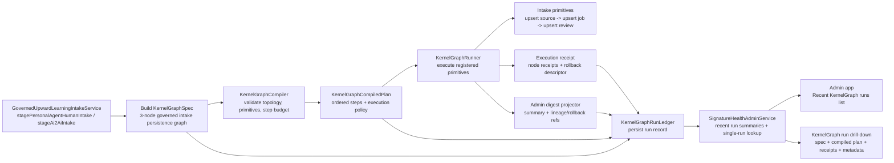

# AVRAI KernelGraph Internal Workflow IR and Governed Self-Improvement Architecture

**Date:** April 3, 2026  
**Status:** Proposed canonical architecture direction  
**Purpose:** Define the internal typed workflow IR, compiler, executor, simulation-first immune system, governed self-improvement loop, and package/file touch map needed for AVRAI to move from hand-wired orchestration to supervised autonomous system improvement.

**Companion authorities:**  
- [`UNIFIED_RUNTIME_KERNEL_BLUEPRINT_2026-02-27.md`](./UNIFIED_RUNTIME_KERNEL_BLUEPRINT_2026-02-27.md)  
- [`URK_INTERFACE_CONTRACTS_2026-02-27.md`](./URK_INTERFACE_CONTRACTS_2026-02-27.md)  
- [`GOVERNED_AUTORESEARCH_KERNEL_ARCHITECTURE_2026-03-14.md`](./GOVERNED_AUTORESEARCH_KERNEL_ARCHITECTURE_2026-03-14.md)  
- [`SIMULATION_TRAINING_GOVERNANCE_DOCTRINE_2026-03-20.md`](./SIMULATION_TRAINING_GOVERNANCE_DOCTRINE_2026-03-20.md)  
- [`AVRAI_REALITY_MODEL_TRAINING_GOVERNANCE_2026-03-23.md`](./AVRAI_REALITY_MODEL_TRAINING_GOVERNANCE_2026-03-23.md)  
- [`REALITY_MODEL_AUTONOMOUS_CONTROL_PLANE_AND_SUPERVISOR_DAEMON_2026-03-30.md`](./REALITY_MODEL_AUTONOMOUS_CONTROL_PLANE_AND_SUPERVISOR_DAEMON_2026-03-30.md)  
- [`../philosophy_implementation/AVRAI_PHILOSOPHY_AND_ARCHITECTURE.md`](../philosophy_implementation/AVRAI_PHILOSOPHY_AND_ARCHITECTURE.md)  
- [`../../MASTER_PLAN.md`](../../MASTER_PLAN.md)

---

## 1. Core Position

AVRAI should introduce an internal typed workflow IR called **KernelGraph**.

KernelGraph is **not** a public programming language and **not** a replacement for the world model. It is the internal representation that allows AVRAI to:

1. author governed runtime flows declaratively,
2. compile those flows into inspectable execution plans,
3. execute them deterministically across sandbox, replay, shadow, canary, and bounded production lanes,
4. let AI propose graph, config, test, policy, and bounded code changes safely,
5. train self-governance from human oversight before widening autonomy,
6. make every self-improvement run replayable, auditable, and admin-legible.

This is the correct place to import the useful pattern from products like WeaveMind:

1. AI should assemble **typed primitives** instead of freehand-writing every orchestration path.
2. Humans should review the **structured graph and evidence**, not reconstruct the system from hidden imperative code.
3. The build layer should accelerate system construction without being allowed to silently replace AVRAI's core safety, privacy, and truth constraints.

AVRAI's core moat remains:

1. Air Gap ingestion physics,
2. truth-surface ontology,
3. on-device world modeling,
4. energy-based ranking,
5. transition prediction,
6. MPC planning,
7. AI2AI-only doctrine,
8. recursive governance.

KernelGraph exists to make those systems easier to compose, test, attack in simulation, heal, and evolve.

---

## 2. Problem Statement

AVRAI already has the shape of a governed cognitive OS, but a large amount of runtime behavior is still hand-wired in imperative service code.

Current symptoms:

1. Similar orchestration logic is repeated across intake, replay, security, AI2AI, admin, and learning surfaces.
2. Canonical runtime loops are defined in docs but not yet represented by one shared executable IR.
3. Admin oversight, replay/simulation, self-healing, and autonomous experimentation each have partial models, but they are not yet unified by one workflow substrate.
4. AI can propose ideas, but there is no single typed pathway for "proposal -> simulation -> red-team -> shadow -> canary -> promotion -> rollback."
5. The system can accumulate governance records, but it cannot yet use one canonical graph/executor to learn self-governance from those records.

Concrete examples already visible in the codebase:

1. [`runtime/avrai_runtime_os/lib/services/reality_model/governed_upward_learning_intake_service.dart`](../../../runtime/avrai_runtime_os/lib/services/reality_model/governed_upward_learning_intake_service.dart) hand-builds governed intake flows for human and AI2AI learning pathways.
2. [`engine/reality_engine/lib/research/governed_autoresearch_worker.dart`](../../../engine/reality_engine/lib/research/governed_autoresearch_worker.dart) provides a bounded research worker, but the worker is still a narrow service rather than one node family inside a general governed improvement IR.
3. [`runtime/avrai_runtime_os/lib/services/security/security_campaign_scheduler.dart`](../../../runtime/avrai_runtime_os/lib/services/security/security_campaign_scheduler.dart), [`security_replay_harness.dart`](../../../runtime/avrai_runtime_os/lib/services/security/security_replay_harness.dart), and [`sandbox_orchestrator_service.dart`](../../../runtime/avrai_runtime_os/lib/services/security/sandbox_orchestrator_service.dart) already encode immune-system concepts, but not yet through one generic compiled plan format.
4. [`runtime/avrai_runtime_os/lib/services/admin/governed_run_kernel_service.dart`](../../../runtime/avrai_runtime_os/lib/services/admin/governed_run_kernel_service.dart) and [`security_immune_system_admin_service.dart`](../../../runtime/avrai_runtime_os/lib/services/admin/security_immune_system_admin_service.dart) already expose governed run/admin snapshots, which should become standard outputs of the new IR rather than one-off aggregations.

KernelGraph addresses this gap.

---

## 3. Desired End State

The target end state is:

1. AVRAI expresses intake, learning, red-team, replay, self-healing, patch generation, promotion, and rollback as typed KernelGraph specs.
2. The Reality Model proposes candidate graph/config/test/patch changes.
3. Runtime OS compiles and executes those changes inside the appropriate lane.
4. Trust Governance enforces immutable constraints before any production-affecting action.
5. Admin receives compressed digests and retains override authority until autonomy is sufficiently proven.
6. Human dispositions become training data for self-governance.

At full maturity:

1. AVRAI continuously learns from user behavior, outcomes, AI2AI signals, and synthetic adversarial pressure.
2. AVRAI attacks **simulated twins** of itself first, never production first.
3. AVRAI synthesizes countermeasures and bounded diffs.
4. AVRAI can heal many routine failures autonomously.
5. AVRAI can eventually draft and validate narrow code/config/policy changes under governed rollout control.

The final system is:

1. self-healed,
2. simulation-first,
3. replay-backed,
4. red-team-hardened,
5. human-legible,
6. auditable,
7. reversible.

---

## 4. Non-Negotiable Non-Goals

KernelGraph must **not** do the following:

1. Replace the Reality Model's mathematical core.
2. Weaken or bypass the Air Gap.
3. Introduce a second truth system parallel to truth surfaces and scope ontology.
4. Allow novel attacks to touch production first.
5. Allow unconstrained autonomous code mutation.
6. Centralize raw private user data for the sake of easier orchestration.
7. Convert AVRAI into a generic workflow SaaS.
8. Move critical safety/privacy decisions into opaque prompts.

KernelGraph is a workflow/control substrate, not the source of truth for user value, dignity, privacy, or planning math.

---

## 5. Architectural Principles

### 5.1 Prong Correctness

KernelGraph must preserve the three-prong split:

1. **Prong 1, Model Truth:** proposes, scores, interprets, and synthesizes.
2. **Prong 2, Runtime Execution:** compiles, schedules, executes, checkpoints, replays, and rolls back.
3. **Prong 3, Trust Governance:** constrains, inspects, approves, rejects, degrades, and halts.

No graph execution path may bypass Prong 3 for production-affecting actions.

### 5.2 Simulation First

The system must never use live production as the first proving ground for a novel attack or countermeasure.

Every improvement or adversarial pressure family must pass, in order:

1. sandbox,
2. replay,
3. shadow,
4. quarantined canary,
5. bounded production-controlled inoculation, if needed.

### 5.3 Typed Envelopes Everywhere

Node boundaries must pass typed envelopes, not free-form maps. Free-form payloads may exist inside bounded `details` or `metadata` fields, but graph connectivity itself must remain typed.

### 5.4 Hard Invariants Remain Hardcoded

The learnable system may tune policy inside bounds. It may not self-edit:

1. Air Gap laws,
2. privacy-mode requirements,
3. consent enforcement,
4. kill-switch semantics,
5. governance-stratum visibility rules,
6. rollout lane ordering,
7. emergency rollback authority,
8. dignity and bias boundaries.

### 5.5 Human Legibility Is a Feature

The system is not "done" when it can act autonomously. It is done when it can summarize and justify that autonomy for admins in a pace humans can keep up with.

### 5.6 AI Should Assemble Primitives, Not Improvise Infrastructure

AVRAI should let AI propose:

1. graph diffs,
2. parameter diffs,
3. attack manifests,
4. replay packs,
5. test suites,
6. bounded patch proposals.

AI should not get default authority to author arbitrary runtime side effects without passing through typed primitives and governed lanes.

---

## 6. What KernelGraph Is

KernelGraph is AVRAI's internal typed workflow IR and execution substrate.

It consists of:

1. **Graph spec:** declarative nodes, edges, policies, lane, truth scope, artifacts, and output contracts.
2. **Primitive registry:** the allowed node types and their schemas.
3. **Compiler:** validates graph topology, I/O contracts, policy requirements, and lane compatibility, then emits a compiled execution plan.
4. **Executor:** runs the plan with checkpointing, receipts, lineage, and deterministic replay support.
5. **Admin truth-surface projection:** converts execution artifacts into readable digests, timelines, and intervention controls.

KernelGraph must represent at least these graph families:

1. intake graphs,
2. runtime orchestration graphs,
3. immune-system red-team graphs,
4. autoresearch graphs,
5. self-healing graphs,
6. promotion graphs,
7. rollback/recovery graphs,
8. patch proposal validation graphs.

---

## 7. Relationship to WeaveMind

The useful import from WeaveMind is narrow and specific:

1. **Typed primitives are faster and safer for AI to compose than freehand boilerplate.**
2. **Graph-native representation improves reviewability.**
3. **A compiler/runtime layer makes it easier to turn proposals into repeatable system behavior.**

AVRAI should copy this pattern only for the internal build layer.

AVRAI should not copy:

1. the notion that the workflow language is the entire product,
2. a generic enterprise orchestration-first worldview,
3. any assumption that performance or safety claims come from the builder alone.

In AVRAI:

1. KernelGraph is the **internal build/execution language**,
2. the Reality Model remains the **brain**,
3. the Security Immune System remains the **adversarial pressure + countermeasure memory**,
4. Runtime OS remains the **body and supervisor**,
5. Admin remains the **governed human oversight surface**.

---

## 8. Top-Level System Diagram

```text
                         +---------------------------+
                         |   Admin Truth Surface     |
                         | pages, digests, controls  |
                         +------------+--------------+
                                      |
                                      v
+-------------+         +-------------+--------------+         +------------------------+
| Reality     |         | Runtime OS / KernelGraph   |         | Trust Governance       |
| Model       |  plan   | compiler + executor +      |  gate   | privacy, consent,      |
| proposes    +-------->+ replay/shadow/canary +----->+        | conviction, rollback,  |
| candidates  |         | artifacts + checkpoints    |         | break-glass            |
+------+------+         +------+------+--------------+         +-----------+------------+
       ^                        |      ^                                    |
       |                        |      |                                    |
       | learn                  |      | receipts                           |
       |                        v      |                                    |
+------+------+         +-------+------+-------+                    +-------+-------+
| Behavior /  | signal  | Simulation / Replay  | attack/counter    | Immune Memory  |
| AI2AI /     +-------->+ / Shadow / Canary    +------------------->+ / Ledger       |
| Mesh / etc. |         | arenas               |                    |                 |
+-------------+         +----------------------+                    +---------------+
```

---

## 9. KernelGraph Contract Model

### 9.1 Core Graph Entities

The minimum shared graph entities are:

1. `KernelGraphSpec`
2. `KernelGraphNodeSpec`
3. `KernelGraphEdgeSpec`
4. `KernelGraphExecutionPolicy`
5. `KernelGraphPrimitiveDescriptor`
6. `KernelGraphCompilationResult`
7. `KernelGraphCompiledPlan`
8. `KernelGraphCheckpoint`
9. `KernelGraphArtifactRef`
10. `KernelGraphExecutionReceipt`
11. `KernelGraphAdminDigest`
12. `KernelGraphDiff`

### 9.2 Suggested Shared Fields

Every `KernelGraphSpec` should include:

1. `graphId`
2. `graphKind`
3. `title`
4. `version`
5. `authorityToken`
6. `truthScope`
7. `governanceStratum`
8. `privacyMode`
9. `environmentLane`
10. `allowedExperimentSurfaces`
11. `requiredConsentScopes`
12. `maxBlastRadius`
13. `rollbackRefs`
14. `adminVisibilityTier`
15. `entryNodeIds`
16. `nodes`
17. `edges`
18. `outputs`
19. `metadata`

### 9.3 Graph Kinds

Suggested first enum:

1. `learningIntake`
2. `runtimeActivation`
3. `autoresearch`
4. `securityRedteam`
5. `selfHeal`
6. `patchValidation`
7. `promotion`
8. `rollback`

### 9.4 Execution Lanes

KernelGraph should align with existing governed run environments:

1. `sandbox`
2. `replay`
3. `shadow`
4. `canary`
5. `productionControlled`

These should reuse and extend [`shared/avrai_core/lib/models/governance/governed_run_models.dart`](../../../shared/avrai_core/lib/models/governance/governed_run_models.dart), not fork the concept into a second lane enum.

### 9.5 Node Semantics

Each node is one of:

1. **pure node:** deterministic, no external side effects,
2. **effect node:** bounded side effect, must declare rollback behavior,
3. **gate node:** policy/consent/conviction/human review decision point,
4. **projection node:** summarizes or emits admin-facing outputs,
5. **artifact node:** writes evidence bundles, manifests, receipts, or patches.

Pure nodes should be freely replayable.

Effect nodes should require:

1. idempotency contract,
2. rollback strategy,
3. egress mode declaration,
4. audit sink binding.

### 9.6 Edge Semantics

Edges must declare:

1. source node,
2. source output port,
3. target node,
4. target input port,
5. payload schema,
6. failure policy,
7. retry policy,
8. checkpoint requirement,
9. if the edge crosses a trust surface or privacy mode boundary.

### 9.7 Execution Policy

Each graph must declare:

1. allowed environment lane,
2. whether external egress is allowed,
3. whether production writes are allowed,
4. whether human review is mandatory,
5. timeout budgets,
6. concurrency budgets,
7. memory budgets,
8. artifact retention policy,
9. lineage retention policy,
10. deterministic replay requirements.

---

## 10. Shared Envelopes and Artifact Types

The following new shared contract families should be introduced under `shared/avrai_core/lib/models/kernel_graph/` and/or adjacent governance/security/research folders.

### 10.1 Runtime and Intake Envelopes

1. `GovernedSignalEnvelope`
2. `GovernedLearningEnvelope`
3. `KernelGraphRunEnvelope`
4. `KernelGraphActionCandidate`
5. `KernelGraphOutcomeReceipt`
6. `KernelGraphRollbackDescriptor`

### 10.2 Improvement and Security Envelopes

1. `WeaknessObservation`
2. `AttackManifest`
3. `CountermeasureCandidate`
4. `PatchProposal`
5. `PatchValidationResult`
6. `SimulationVerdict`
7. `PromotionManifest`

### 10.3 Admin and Evidence Artifacts

1. `AdminGovernanceDigest`
2. `GraphExecutionTimelineEvent`
3. `GraphCheckpointSummary`
4. `GraphExplanationBundle`
5. `GraphEvidencePack`
6. `GraphDiffReviewRecord`

### 10.4 Existing Shared Models to Extend

Existing files that should be extended rather than replaced:

1. [`shared/avrai_core/lib/models/governance/governed_run_models.dart`](../../../shared/avrai_core/lib/models/governance/governed_run_models.dart)
2. [`shared/avrai_core/lib/models/research/governed_autoresearch_models.dart`](../../../shared/avrai_core/lib/models/research/governed_autoresearch_models.dart)
3. [`shared/avrai_core/lib/models/security/security_immune_models.dart`](../../../shared/avrai_core/lib/models/security/security_immune_models.dart)
4. [`shared/avrai_core/lib/models/truth/truth_scope_descriptor.dart`](../../../shared/avrai_core/lib/models/truth/truth_scope_descriptor.dart)
5. [`shared/avrai_core/lib/services/temporal_lineage_sink.dart`](../../../shared/avrai_core/lib/services/temporal_lineage_sink.dart)

These files already encode lanes, campaigns, checkpoints, truth scopes, and immune-system artifacts. KernelGraph should become the common substrate underneath them.

---

## 11. Primitive Registry

KernelGraph requires a primitive registry that AI and humans both reference.

The registry should live in:

1. `shared/avrai_core/lib/models/kernel_graph/primitive_descriptor.dart`
2. `runtime/avrai_runtime_os/lib/kernel/graph/kernel_graph_primitive_registry.dart`

Each primitive descriptor should define:

1. primitive id,
2. category,
3. input schema,
4. output schema,
5. allowed lanes,
6. allowed privacy modes,
7. truth-surface classification,
8. whether it is pure/effect/gate/projection/artifact,
9. whether it is AI-composable,
10. rollback requirements,
11. admin visibility implications,
12. test fixtures required for execution.

### 11.1 First Primitive Families

#### Intake primitives

1. `classify_correction`
2. `extract_domain_hints`
3. `extract_referenced_entities`
4. `extract_questions`
5. `extract_preference_signals`
6. `extract_signal_tags`
7. `stamp_temporal_lineage`
8. `queue_upward_review`

#### Governance primitives

1. `resolve_privacy_mode`
2. `consent_gate`
3. `conviction_gate`
4. `human_override_gate`
5. `break_glass_gate`
6. `register_rollback`
7. `write_lineage_record`
8. `emit_governance_digest`

#### Reality primitives

1. `build_world_state`
2. `encode_state`
3. `score_energy`
4. `predict_transition`
5. `plan_with_mpc`
6. `derive_why_projection`
7. `derive_when_projection`
8. `derive_who_what_where_how`

#### Immune-system primitives

1. `synthesize_attack_manifest`
2. `run_replay_arena`
3. `run_shadow_arena`
4. `run_redteam_battery`
5. `evaluate_countermeasure`
6. `generate_patch_proposal`
7. `score_patch_risk`
8. `promote_countermeasure_candidate`

#### Execution primitives

1. `commit_change`
2. `recover`
3. `rollback`
4. `quarantine`
5. `bounded_degrade`
6. `dispatch_receipt`

#### Admin primitives

1. `emit_timeline_event`
2. `emit_checkpoint_summary`
3. `emit_run_digest`
4. `request_admin_review`
5. `record_admin_disposition`

### 11.2 Primitive Ownership

Primitive implementation ownership should be split by prong:

1. model primitives mostly in `engine/reality_engine`,
2. runtime and gate primitives mostly in `runtime/avrai_runtime_os`,
3. contracts in `shared/avrai_core`,
4. UI projections in `apps/admin_app`.

---

## 12. Compiler Architecture

### 12.1 Compiler Responsibilities

The compiler should:

1. validate graph syntax,
2. validate node/edge I/O schemas,
3. resolve primitive descriptors,
4. check topological ordering,
5. detect illegal cycles,
6. enforce lane compatibility,
7. enforce privacy-mode compatibility,
8. enforce truth-surface compatibility,
9. enforce effect-node rollback registration,
10. emit a compiled execution plan with deterministic step ids.

### 12.2 Compiler Output

The compiler should emit:

1. `KernelGraphCompiledPlan`
2. `KernelGraphCompilationDiagnostics`
3. `KernelGraphExecutionBudget`
4. `KernelGraphRequiredArtifacts`
5. `KernelGraphRollbackPlan`
6. `KernelGraphAdminProjectionPlan`

### 12.3 Compiler Placement

Compiler implementation should live under:

1. `runtime/avrai_runtime_os/lib/kernel/graph/compiler/`

Likely first files:

1. `kernel_graph_compiler.dart`
2. `kernel_graph_schema_validator.dart`
3. `kernel_graph_policy_validator.dart`
4. `kernel_graph_topology_validator.dart`
5. `kernel_graph_compilation_result.dart`

### 12.4 Compiler Inputs from Existing Contracts

The compiler must integrate with existing contract surfaces:

1. [`runtime/avrai_runtime_os/lib/kernel/contracts/urk_self_learning_governance_contract.dart`](../../../runtime/avrai_runtime_os/lib/kernel/contracts/urk_self_learning_governance_contract.dart)
2. [`runtime/avrai_runtime_os/lib/kernel/contracts/urk_learning_update_governance_contract.dart`](../../../runtime/avrai_runtime_os/lib/kernel/contracts/urk_learning_update_governance_contract.dart)
3. [`runtime/avrai_runtime_os/lib/kernel/contracts/urk_kernel_activation_engine_contract.dart`](../../../runtime/avrai_runtime_os/lib/kernel/contracts/urk_kernel_activation_engine_contract.dart)
4. [`runtime/avrai_runtime_os/lib/kernel/contracts/urk_kernel_promotion_lifecycle_contract.dart`](../../../runtime/avrai_runtime_os/lib/kernel/contracts/urk_kernel_promotion_lifecycle_contract.dart)
5. [`runtime/avrai_runtime_os/lib/kernel/contracts/urk_stage_a_trigger_privacy_no_egress_contract.dart`](../../../runtime/avrai_runtime_os/lib/kernel/contracts/urk_stage_a_trigger_privacy_no_egress_contract.dart)
6. [`runtime/avrai_runtime_os/lib/kernel/contracts/urk_governance_inspection_contract.dart`](../../../runtime/avrai_runtime_os/lib/kernel/contracts/urk_governance_inspection_contract.dart)

These contracts should become compile-time policy checks, not merely runtime best-effort conventions.

---

## 13. Executor Architecture

### 13.1 Executor Responsibilities

The executor should:

1. instantiate compiled plans,
2. bind runtime inputs,
3. execute nodes in order,
4. checkpoint state,
5. support pause/resume/redirect/stop,
6. support deterministic replay,
7. emit receipts and artifacts,
8. call governance gates before effectful transitions,
9. record admin-relevant summaries,
10. support rollback and bounded degrade.

### 13.2 State Machine

KernelGraph run states should align with governed run lifecycle:

1. `draft`
2. `approved`
3. `queued`
4. `running`
5. `pausing`
6. `paused`
7. `review`
8. `stopped`
9. `completed`
10. `failed`
11. `redirectPending`
12. `archived`

This should reuse the lifecycle vocabulary already present in governed run models.

### 13.3 Checkpoint Model

Each checkpoint should include:

1. step index,
2. graph node id,
3. state snapshot ref,
4. input artifact refs,
5. output artifact refs,
6. metrics,
7. contradiction flags,
8. whether human review is required,
9. rollback anchor,
10. lineage refs.

### 13.4 Determinism

Replay and simulation runs must be deterministic enough to:

1. replay the same graph under the same seed/config and obtain materially comparable outputs,
2. prove what changed between baseline and candidate,
3. explain why a countermeasure was promoted or rejected.

Sources of nondeterminism must be explicit:

1. RNG seed,
2. model version,
3. prompt/policy version,
4. clock policy,
5. data snapshot refs,
6. lane configuration.

### 13.5 Executor Placement

Executor implementation should live under:

1. `runtime/avrai_runtime_os/lib/kernel/graph/executor/`

Likely first files:

1. `kernel_graph_executor.dart`
2. `kernel_graph_checkpoint_store.dart`
3. `kernel_graph_receipt_dispatcher.dart`
4. `kernel_graph_artifact_store.dart`
5. `kernel_graph_run_supervisor.dart`

### 13.6 Reuse Opportunities

The executor should integrate with:

1. [`runtime/avrai_runtime_os/lib/kernel/service_contracts/urk_kernel_control_plane_service.dart`](../../../runtime/avrai_runtime_os/lib/kernel/service_contracts/urk_kernel_control_plane_service.dart)
2. [`runtime/avrai_runtime_os/lib/kernel/service_contracts/urk_governed_runtime_registry_service.dart`](../../../runtime/avrai_runtime_os/lib/kernel/service_contracts/urk_governed_runtime_registry_service.dart)
3. [`runtime/avrai_runtime_os/lib/services/admin/governed_run_kernel_service.dart`](../../../runtime/avrai_runtime_os/lib/services/admin/governed_run_kernel_service.dart)
4. [`runtime/avrai_runtime_os/lib/services/admin/self_heal_governance_adapter_service.dart`](../../../runtime/avrai_runtime_os/lib/services/admin/self_heal_governance_adapter_service.dart)

KernelGraph should sit beneath these services and gradually simplify them.

---

## 14. Mapping to the Canonical URK Loop

KernelGraph should become the executable representation of the documented URK loop.

```text
ingestSignal(signal)
normalizeToDomainGraph(delta)
buildWorldState(snapshot)
generateCandidates()
scoreWithEnergy()
simulateWithTransitionPredictor()
planWithMPC()
applyPolicyAndConvictionGates()
commitAction()
observeOutcome()
writeMemoryTuple()
lineageAndAuditRecord()
promotionPipelineIfApplicable()
```

The key design rule is:

1. documented loop stages become primitive families,
2. graph compilation proves a runtime type actually implements the stages it claims,
3. admin can inspect any run at the level of these canonical steps instead of reverse-engineering custom service code.

---

## 15. SimulationArena, ReplayArena, Shadow, and Canary

### 15.1 Core Rule

AVRAI must attack itself through simulation before it challenges any live surface.

### 15.2 Arena Types

KernelGraph should support these arenas:

1. **Sandbox arena:** isolated experiments and synthetic micro-tests.
2. **Replay arena:** historical/city/event/AI2AI/security replay packs.
3. **Shadow arena:** mirrors real traffic and state transitions without real side effects.
4. **Canary arena:** tiny bounded live cohort or bounded service partition.
5. **Production-controlled inoculation lane:** optional, only after the above have passed.

### 15.3 Existing Replay Foundations to Reuse

Existing replay contracts should be treated as first-class KernelGraph inputs, not secondary utilities:

1. [`shared/avrai_core/lib/models/temporal/replay_*`](../../../shared/avrai_core/lib/models/temporal)
2. [`runtime/avrai_runtime_os/lib/services/prediction/*replay*`](../../../runtime/avrai_runtime_os/lib/services/prediction)
3. [`runtime/avrai_runtime_os/lib/services/admin/replay_simulation_admin_service.dart`](../../../runtime/avrai_runtime_os/lib/services/admin/replay_simulation_admin_service.dart)
4. [`runtime/avrai_runtime_os/lib/services/security/security_replay_harness.dart`](../../../runtime/avrai_runtime_os/lib/services/security/security_replay_harness.dart)

### 15.4 Simulation Outputs

Every simulation run should produce:

1. baseline verdict,
2. candidate verdict,
3. delta metrics,
4. contradiction set,
5. regressions,
6. admin digest,
7. promotion recommendation,
8. rollback readiness proof.

### 15.5 Novel Attack Policy

A novel attack family may not touch a live surface unless:

1. it has a complete attack manifest,
2. it passed simulation,
3. it passed shadow,
4. blast radius is bounded,
5. rollback path is verified,
6. privacy and truth-surface boundaries remain intact,
7. required human review threshold is satisfied.

---

## 16. Security Immune System Integration

KernelGraph should become the shared workflow substrate for the existing security immune system.

### 16.1 Existing Surfaces to Integrate

The first integration targets are:

1. [`runtime/avrai_runtime_os/lib/services/security/security_campaign_registry.dart`](../../../runtime/avrai_runtime_os/lib/services/security/security_campaign_registry.dart)
2. [`runtime/avrai_runtime_os/lib/services/security/security_campaign_scheduler.dart`](../../../runtime/avrai_runtime_os/lib/services/security/security_campaign_scheduler.dart)
3. [`runtime/avrai_runtime_os/lib/services/security/sandbox_orchestrator_service.dart`](../../../runtime/avrai_runtime_os/lib/services/security/sandbox_orchestrator_service.dart)
4. [`runtime/avrai_runtime_os/lib/services/security/security_scout_coordinator.dart`](../../../runtime/avrai_runtime_os/lib/services/security/security_scout_coordinator.dart)
5. [`runtime/avrai_runtime_os/lib/services/security/immune_memory_ledger.dart`](../../../runtime/avrai_runtime_os/lib/services/security/immune_memory_ledger.dart)
6. [`runtime/avrai_runtime_os/lib/services/security/countermeasure_propagation_service.dart`](../../../runtime/avrai_runtime_os/lib/services/security/countermeasure_propagation_service.dart)
7. [`runtime/avrai_runtime_os/lib/services/security/security_kernel_release_gate_service.dart`](../../../runtime/avrai_runtime_os/lib/services/security/security_kernel_release_gate_service.dart)

### 16.2 Security Graph Flow

Canonical security graph:

1. observe trigger,
2. build attack manifest,
3. run replay pack,
4. run proof battery,
5. classify findings,
6. generate countermeasure bundle,
7. validate shadow coverage,
8. score release gate readiness,
9. emit admin digest,
10. promote or block.

### 16.3 Immune Memory

Immune memory should capture:

1. attack family,
2. affected surfaces,
3. detection signature,
4. containment sequence,
5. countermeasure lineage,
6. replay proof refs,
7. recurrence risk,
8. rollout status.

This should align with the existing `SecurityLearningMoment` and `ImmuneMemoryRecord` families instead of inventing a parallel memory store.

---

## 17. Governed Autoresearch Integration

KernelGraph should not replace governed autoresearch. It should become the substrate on which governed autoresearch runs.

### 17.1 Existing Surfaces to Integrate

1. [`engine/reality_engine/lib/research/governed_autoresearch_worker.dart`](../../../engine/reality_engine/lib/research/governed_autoresearch_worker.dart)
2. [`shared/avrai_core/lib/models/research/governed_autoresearch_models.dart`](../../../shared/avrai_core/lib/models/research/governed_autoresearch_models.dart)
3. [`runtime/avrai_runtime_os/lib/services/admin/research_activity_service.dart`](../../../runtime/avrai_runtime_os/lib/services/admin/research_activity_service.dart)
4. [`runtime/avrai_runtime_os/lib/services/admin/governed_run_kernel_service.dart`](../../../runtime/avrai_runtime_os/lib/services/admin/governed_run_kernel_service.dart)

### 17.2 Autoresearch Graph Flow

Canonical autoresearch graph:

1. register charter,
2. resolve truth scope,
3. build internal evidence-first plan,
4. run replay/sandbox experiment,
5. evaluate metrics,
6. generate explanation,
7. request open-web egress if warranted,
8. checkpoint,
9. request review or redirect,
10. emit governed run record.

### 17.3 Key Constraint

Autoresearch remains:

1. sandbox-bound first,
2. inspectable,
3. stoppable,
4. non-authoritative for production mutation.

KernelGraph helps by making this the standard path for other improvement families too.

---

## 18. Learning Intake Integration

The open file is the best immediate proving ground for KernelGraph.

### 18.1 Why This File Is a Strong First Slice

[`runtime/avrai_runtime_os/lib/services/reality_model/governed_upward_learning_intake_service.dart`](../../../runtime/avrai_runtime_os/lib/services/reality_model/governed_upward_learning_intake_service.dart) already:

1. classifies source type,
2. extracts structured hints,
3. derives questions and preference signals,
4. computes signal tags,
5. stamps conviction tier,
6. writes queueable governed artifacts.

This is exactly the kind of repeated orchestration logic that should become a compiled graph instead of remaining duplicated imperative code.

### 18.2 First Graph Conversion Candidate

Human intake graph:

```yaml
graphKind: learningIntake
environmentLane: productionControlled
entryNodeIds:
  - classify_correction
nodes:
  - classify_correction
  - extract_domain_hints
  - extract_referenced_entities
  - extract_questions
  - extract_preference_signals
  - extract_signal_tags
  - resolve_conviction_tier
  - stamp_temporal_lineage
  - queue_upward_review
```

AI2AI intake graph:

```yaml
graphKind: learningIntake
environmentLane: productionControlled
entryNodeIds:
  - classify_correction
nodes:
  - classify_correction
  - extract_domain_hints
  - extract_referenced_entities
  - extract_questions
  - extract_preference_signals
  - extract_signal_tags
  - resolve_ai2ai_conviction_tier
  - stamp_temporal_lineage
  - queue_upward_review
```

### 18.3 Current Bounded Slice Data Flow

The current bounded implementation is intentionally narrow. It takes the existing upward-learning intake staging path, wraps the persistence path in a `KernelGraph` spec, compiles it, executes it, records the run in the ledger, and exposes the result in admin drill-down.



This slice is deliberately off the training/simulation hot path. Its purpose is to prove the substrate on a governed intake workflow before the same compiler/runner/ledger surface expands into immune-system and autoresearch lanes.

### 18.4 Immediate Refactor Strategy

Step 1:

1. preserve current public service methods,
2. move repeated extraction/tagging logic behind primitive handlers,
3. have the service call a compiled KernelGraph plan instead of hand-building the whole sequence.

Step 2:

1. emit a `GovernedLearningEnvelope`,
2. write standardized lineage/admin receipts,
3. feed the same graph runner into later AI2AI and locality learning lanes.

---

## 19. Patch Proposal and Autonomous Coding Path

### 19.1 Principle

The system should not jump directly from "detects weakness" to "rewrites repo."

The widening sequence should be:

1. propose graph diff,
2. propose config diff,
3. propose prompt/rubric diff,
4. propose test additions,
5. propose bounded patch diff,
6. only later widen into broader code-change authority.

### 19.2 Patch Proposal Model

Every `PatchProposal` should include:

1. touched file paths,
2. ownership area,
3. reason for change,
4. linked weakness or finding ids,
5. replay evidence,
6. red-team evidence,
7. expected behavior delta,
8. rollback patch or revert reference,
9. blast radius classification,
10. human approval requirement.

### 19.3 Safe Mutation Zones

The first autonomous mutation zones should be:

1. experiment manifests,
2. graph manifests,
3. test fixtures,
4. replay scenario configs,
5. admin digest formatting,
6. bounded heuristics/prompt/rubric files,
7. generated non-critical adapters.

### 19.4 Protected Zones

These should remain high-friction or human-only far longer:

1. Air Gap extraction core,
2. consent/privacy enforcement,
3. security crypto surfaces,
4. truth-surface classification rules,
5. rollout/kill-switch authority,
6. core world-model math,
7. external egress controls.

### 19.5 Production Mutation Rule

No patch proposal may land without:

1. simulation evidence,
2. regression battery results,
3. rollback proof,
4. lane-appropriate promotion gate,
5. admin approval when blast radius exceeds configured thresholds.

---

## 20. Admin Truth Surface

The admin app must remain the compression surface for autonomy.

### 20.1 Existing Admin Surfaces to Extend

1. [`apps/admin_app/lib/ui/pages/urk_kernel_console_page.dart`](../../../apps/admin_app/lib/ui/pages/urk_kernel_console_page.dart)
2. [`apps/admin_app/lib/ui/pages/security_immune_system_page.dart`](../../../apps/admin_app/lib/ui/pages/security_immune_system_page.dart)
3. [`apps/admin_app/lib/ui/pages/research_center_page.dart`](../../../apps/admin_app/lib/ui/pages/research_center_page.dart)
4. [`apps/admin_app/lib/ui/pages/reality_system_oversight_page.dart`](../../../apps/admin_app/lib/ui/pages/reality_system_oversight_page.dart)
5. [`apps/admin_app/lib/ui/pages/world_simulation_lab_page.dart`](../../../apps/admin_app/lib/ui/pages/world_simulation_lab_page.dart)
6. [`apps/admin_app/lib/ui/pages/governance_audit_page.dart`](../../../apps/admin_app/lib/ui/pages/governance_audit_page.dart)

### 20.2 Required New Admin Capabilities

1. Graph run timeline viewer
2. Graph diff review panel
3. Simulation verdict summary panel
4. Attack manifest viewer
5. Countermeasure promotion cockpit
6. Patch proposal review lane
7. Override and redirect actions
8. Lane progression viewer: sandbox -> replay -> shadow -> canary -> productionControlled

### 20.3 Admin Digest Format

The minimum admin digest should answer:

1. what changed,
2. why it changed,
3. what evidence was used,
4. what simulations were run,
5. what attacks were tried,
6. what regressions were detected or avoided,
7. what blast radius is proposed,
8. what rollback exists,
9. whether human action is required.

### 20.4 Human Oversight as Governance Training Data

Every admin action should itself be captured as structured supervision:

1. approve,
2. reject,
3. redirect,
4. request more evidence,
5. reduce blast radius,
6. rollback,
7. hard stop,
8. bounded degrade.

These records become training data for later self-governance.

---

## 21. Package and File Touch Map

This section names the concrete repo surfaces KernelGraph will need to create or change.

### 21.1 `shared/avrai_core`

#### New directories and files

1. `shared/avrai_core/lib/models/kernel_graph/kernel_graph_spec.dart`
2. `shared/avrai_core/lib/models/kernel_graph/kernel_graph_node_spec.dart`
3. `shared/avrai_core/lib/models/kernel_graph/kernel_graph_edge_spec.dart`
4. `shared/avrai_core/lib/models/kernel_graph/kernel_graph_execution_policy.dart`
5. `shared/avrai_core/lib/models/kernel_graph/kernel_graph_compiled_plan.dart`
6. `shared/avrai_core/lib/models/kernel_graph/kernel_graph_artifact_ref.dart`
7. `shared/avrai_core/lib/models/kernel_graph/kernel_graph_checkpoint.dart`
8. `shared/avrai_core/lib/models/kernel_graph/kernel_graph_execution_receipt.dart`
9. `shared/avrai_core/lib/models/kernel_graph/kernel_graph_admin_digest.dart`
10. `shared/avrai_core/lib/models/kernel_graph/attack_manifest.dart`
11. `shared/avrai_core/lib/models/kernel_graph/patch_proposal.dart`
12. `shared/avrai_core/lib/models/kernel_graph/simulation_verdict.dart`

#### Existing files to extend

1. `shared/avrai_core/lib/models/governance/governed_run_models.dart`
2. `shared/avrai_core/lib/models/research/governed_autoresearch_models.dart`
3. `shared/avrai_core/lib/models/security/security_immune_models.dart`
4. `shared/avrai_core/lib/services/truth_scope_registry.dart`
5. `shared/avrai_core/lib/services/temporal_lineage_sink.dart`
6. `shared/avrai_core/lib/avra_core.dart`

#### Why

These are the contracts every package depends on. KernelGraph cannot be trustworthy if its core types are hidden inside one runtime package.

### 21.2 `engine/reality_engine`

#### New directories and files

1. `engine/reality_engine/lib/improvement/improvement_kernel.dart`
2. `engine/reality_engine/lib/improvement/patch_proposal_kernel.dart`
3. `engine/reality_engine/lib/improvement/countermeasure_synthesizer.dart`
4. `engine/reality_engine/lib/improvement/governance_tutor.dart`
5. `engine/reality_engine/lib/security/synthetic_adversary_kernel.dart`
6. `engine/reality_engine/lib/security/attack_strategy_library.dart`
7. `engine/reality_engine/lib/kernel_graph/model_primitives/`

#### Existing files to extend

1. `engine/reality_engine/lib/research/governed_autoresearch_worker.dart`
2. `engine/reality_engine/lib/reality_engine.dart`
3. `engine/reality_engine/lib/memory/air_gap/tuple_extraction_engine.dart`
4. forecast and trajectory kernels where simulation outputs should feed back into improvement scoring

#### Why

This is where proposal intelligence lives. The Reality Model should decide which hypotheses, attacks, countermeasures, and patches are worth attempting. It should not directly execute them.

### 21.3 `runtime/avrai_runtime_os`

#### New directories and files

1. `runtime/avrai_runtime_os/lib/kernel/graph/compiler/`
2. `runtime/avrai_runtime_os/lib/kernel/graph/executor/`
3. `runtime/avrai_runtime_os/lib/kernel/graph/primitives/`
4. `runtime/avrai_runtime_os/lib/services/improvement/improvement_run_service.dart`
5. `runtime/avrai_runtime_os/lib/services/improvement/patch_validation_service.dart`
6. `runtime/avrai_runtime_os/lib/services/improvement/promotion_governor.dart`
7. `runtime/avrai_runtime_os/lib/services/improvement/healing_governor.dart`
8. `runtime/avrai_runtime_os/lib/services/improvement/live_inoculation_controller.dart`
9. `runtime/avrai_runtime_os/lib/services/improvement/simulation_arena_service.dart`
10. `runtime/avrai_runtime_os/lib/services/improvement/kernel_graph_run_store.dart`

#### Existing files/directories to extend

1. `runtime/avrai_runtime_os/lib/services/reality_model/governed_upward_learning_intake_service.dart`
2. `runtime/avrai_runtime_os/lib/services/security/immune_memory_ledger.dart`
3. `runtime/avrai_runtime_os/lib/services/security/security_campaign_registry.dart`
4. `runtime/avrai_runtime_os/lib/services/security/security_campaign_scheduler.dart`
5. `runtime/avrai_runtime_os/lib/services/security/security_replay_harness.dart`
6. `runtime/avrai_runtime_os/lib/services/security/sandbox_orchestrator_service.dart`
7. `runtime/avrai_runtime_os/lib/services/security/countermeasure_propagation_service.dart`
8. `runtime/avrai_runtime_os/lib/services/admin/governed_run_kernel_service.dart`
9. `runtime/avrai_runtime_os/lib/services/admin/security_immune_system_admin_service.dart`
10. `runtime/avrai_runtime_os/lib/services/admin/replay_simulation_admin_service.dart`
11. `runtime/avrai_runtime_os/lib/services/admin/self_heal_governance_adapter_service.dart`
12. `runtime/avrai_runtime_os/lib/services/ai_infrastructure/model_safety_supervisor.dart`
13. `runtime/avrai_runtime_os/lib/services/ai_infrastructure/kernel_governance_gate.dart`
14. `runtime/avrai_runtime_os/lib/kernel/contracts/*.dart`
15. `runtime/avrai_runtime_os/lib/kernel/service_contracts/*.dart`

#### Why

Runtime OS is the authoritative supervisor. This package must compile, execute, checkpoint, replay, gate, promote, and roll back KernelGraph runs.

### 21.4 `apps/admin_app`

#### New or extended surfaces

1. extend `urk_kernel_console_page.dart`
2. extend `security_immune_system_page.dart`
3. extend `research_center_page.dart`
4. extend `world_simulation_lab_page.dart`
5. add graph timeline widgets
6. add patch proposal review widgets
7. add simulation verdict panels
8. add lane progression and rollback state displays

#### Why

Admin must remain capable of keeping up with the autonomous system through compressed truth surfaces.

### 21.5 `apps/avrai_app`

Minimal direct touch expected initially:

1. consume projections,
2. display bounded user-facing explanations when needed,
3. avoid becoming the control plane.

Likely touch points:

1. headless background runtime entrypoint,
2. settings/learning timeline surfaces,
3. admin handoff routes where appropriate.

### 21.6 User-Facing Mouth + Data Center Surfaces

User-facing access to KernelGraph and governed-learning state should not copy the admin surface.

The correct shape is:

1. **chat is the mouth**,
2. **the profile data center is the control surface**,
3. **both are projections of the same governed records**.

The mouth should be the primary access path. When a user asks:

1. "Why did you do that?"
2. "What did you learn from that?"
3. "What do you know about me?"
4. "Did you change anything based on my behavior?"

AVRAI should answer in bounded natural language first, then offer actions such as:

1. show more detail,
2. open data center,
3. correct this,
4. stop using this for learning,
5. forget this record.

The Data Center should expose the same underlying truth in a structured form with control affordances. It should let the user:

1. inspect what was learned,
2. inspect what was inferred,
3. inspect what was used in decisions,
4. correct incorrect inferences,
5. revoke learning use,
6. request export,
7. request deletion where policy allows.

This requires a user-facing projection layer that is distinct from admin truth surfaces.

Recommended runtime/application components:

1. `UserExplanationProjectionService`
2. `UserDataCenterProjectionService`
3. `UserVisibleRecord`
4. `UserVisibleActionSet`
5. `UserVisibilityPolicy`
6. `UserRedactionPolicy`

The canonical runtime artifact under those projections should be a governed-learning envelope emitted by the upward loop. That envelope should contain:

1. what source produced the learning event,
2. what summary can safely be shown,
3. what domains and entities were implicated,
4. what conviction tier and hierarchy path were applied,
5. what human-review status applies,
6. what KernelGraph run and lineage refs back the event,
7. what user-facing actions are allowed.

Chat should never improvise this explanation from raw state. It should render a bounded explanation from the projection and its policy-constrained visible fields.

The Data Center should never expose raw internal surfaces by default. It should not show:

1. compiled KernelGraph steps,
2. immune-system internals,
3. red-team artifacts,
4. rollback mechanics,
5. cross-user traces,
6. security-sensitive topology.

Instead it should show user-safe equivalents:

1. what changed,
2. why it changed,
3. what evidence category informed it,
4. how certain AVRAI is,
5. whether the change was local, bounded, or promoted,
6. what the user can do next.

The first implementation step should not be a full user UI rewrite. It should be:

1. emit a canonical `GovernedLearningEnvelope` from the upward loop,
2. persist it alongside the governed intake records,
3. let future chat and Data Center surfaces consume that same envelope,
4. keep admin drill-down as the richer internal surface.

---

## 22. Suggested Filesystem Layout

```text
shared/avrai_core/lib/models/kernel_graph/
  kernel_graph_spec.dart
  kernel_graph_node_spec.dart
  kernel_graph_edge_spec.dart
  kernel_graph_execution_policy.dart
  kernel_graph_checkpoint.dart
  kernel_graph_artifact_ref.dart
  kernel_graph_execution_receipt.dart
  kernel_graph_admin_digest.dart
  attack_manifest.dart
  patch_proposal.dart
  simulation_verdict.dart

engine/reality_engine/lib/improvement/
  improvement_kernel.dart
  patch_proposal_kernel.dart
  countermeasure_synthesizer.dart
  governance_tutor.dart

engine/reality_engine/lib/security/
  synthetic_adversary_kernel.dart
  attack_strategy_library.dart

runtime/avrai_runtime_os/lib/kernel/graph/compiler/
  kernel_graph_compiler.dart
  kernel_graph_schema_validator.dart
  kernel_graph_policy_validator.dart
  kernel_graph_topology_validator.dart

runtime/avrai_runtime_os/lib/kernel/graph/executor/
  kernel_graph_executor.dart
  kernel_graph_run_supervisor.dart
  kernel_graph_checkpoint_store.dart
  kernel_graph_artifact_store.dart
  kernel_graph_receipt_dispatcher.dart

runtime/avrai_runtime_os/lib/kernel/graph/primitives/
  intake_primitives.dart
  governance_primitives.dart
  reality_primitives.dart
  immune_primitives.dart
  execution_primitives.dart
  admin_primitives.dart

runtime/avrai_runtime_os/lib/services/improvement/
  improvement_run_service.dart
  simulation_arena_service.dart
  healing_governor.dart
  promotion_governor.dart
  patch_validation_service.dart
  live_inoculation_controller.dart
```

---

## 23. Rollout Phases

### Phase 0: Contract Seeding

Deliver:

1. shared KernelGraph models,
2. primitive descriptor framework,
3. compiler skeleton,
4. executor skeleton,
5. governed run record mapping.

### Phase 1: Learning Intake Vertical Slice

Deliver:

1. convert governed upward intake into a compiled graph,
2. preserve current public service API,
3. emit standardized receipts and digests,
4. prove deterministic replay for this slice.

### Phase 2: Security Immune Vertical Slice

Deliver:

1. one security campaign family represented as KernelGraph,
2. replay harness integration,
3. immune memory write-back,
4. admin digest integration.

### Phase 3: Governed Autoresearch Unification

Deliver:

1. run autoresearch through the same compiler/executor substrate,
2. preserve current charter/checkpoint/admin controls,
3. expose graph timelines in admin.

### Phase 4: Promotion and Rollback Unification

Deliver:

1. standard shadow/canary promotion flows,
2. rollback manifests,
3. release gate integration.

### Phase 5: Patch Proposal Lane

Deliver:

1. bounded patch proposal model,
2. replay + red-team validation graph,
3. admin diff review surface,
4. config/test/graph diffs before broader code diffs.

### Phase 6: Governance Tutor and Assisted Autonomy

Deliver:

1. structured admin dispositions as training data,
2. recommendation engine for future approvals/rejections,
3. widening autonomy only in low-risk lanes first.

### Phase 7: Bounded Autonomous Coding

Deliver:

1. graph/config/test mutation autonomy,
2. narrow code mutation in safe zones,
3. evidence-linked promotion gating.

---

## 24. Failure Modes and Mitigations

### 24.1 Failure Mode: IR Becomes Magic

Risk:

1. Engineers lose the ability to understand runtime behavior because too much logic is hidden in graph execution.

Mitigation:

1. every node remains backed by explicit typed code,
2. every compiled plan emits readable execution output,
3. graph specs remain versioned artifacts,
4. admin and engineer tooling expose node-level traces.

### 24.2 Failure Mode: Autonomy Outruns Legibility

Risk:

1. The system improves itself faster than humans can understand.

Mitigation:

1. mandatory admin digest output,
2. review thresholds by blast radius,
3. progressive autonomy widening,
4. human action as training data.

### 24.3 Failure Mode: Simulation Gap

Risk:

1. Countermeasures pass simulation but fail live reality.

Mitigation:

1. shadow lane before canary,
2. explicit realism scoring,
3. rollout limits,
4. rollback verification,
5. immune memory of simulation-vs-live divergence.

### 24.4 Failure Mode: Unsafe Code Mutation

Risk:

1. Autonomous code changes corrupt protected surfaces.

Mitigation:

1. protected zone registry,
2. safe mutation zones,
3. patch proposals as artifacts rather than implicit commits,
4. replay/red-team proof requirement,
5. human approval thresholds.

### 24.5 Failure Mode: Privacy Boundary Erosion

Risk:

1. Simulation or improvement loops demand more raw data than allowed.

Mitigation:

1. Air Gap remains non-negotiable,
2. no raw-data execution lanes outside allowed extraction contexts,
3. compile-time privacy compatibility checks,
4. no-egress gates by default.

---

## 25. Testing Strategy

### 25.1 Unit Tests

1. graph schema validation,
2. node I/O contracts,
3. policy validator behavior,
4. compiler diagnostics,
5. executor checkpoint transitions.

### 25.2 Contract Tests

1. graph spec round-trips,
2. artifact receipt round-trips,
3. governed run mapping,
4. admin digest serialization.

### 25.3 Replay Tests

1. learning intake replay,
2. security campaign replay,
3. autoresearch replay,
4. patch validation replay.

### 25.4 Integration Tests

1. graph compile -> execute -> checkpoint -> digest,
2. replay -> shadow -> canary promotion path,
3. rollback invocation path,
4. admin action round-trip.

### 25.5 Red-Team Tests

1. malformed graph specs,
2. illegal lane escalations,
3. privacy-mode violations,
4. effect node without rollback registration,
5. forbidden production writes from simulation-only graphs,
6. patch proposals touching protected zones.

### 25.6 Determinism Tests

1. replay under fixed seed,
2. diff between baseline and candidate with same inputs,
3. deterministic receipts for the same artifact and graph version.

---

## 26. Acceptance Criteria

KernelGraph is ready for real use when:

1. one production learning-intake slice runs through compiled KernelGraph,
2. one security immune campaign runs through compiled KernelGraph,
3. governed autoresearch can emit graph-backed checkpoints and explanations,
4. admin can inspect graph runs without raw trace spelunking,
5. replay/shadow/canary transitions are standardized,
6. rollback refs are mandatory for effectful nodes,
7. novel attacks cannot reach production without lower-lane evidence,
8. human dispositions are captured as structured governance training data,
9. the system can propose graph/config/test diffs autonomously,
10. the system remains fully aligned with Air Gap, truth-surface, and governance invariants.

---

## 27. Immediate Recommended Next Steps

1. Seed shared KernelGraph contracts in `shared/avrai_core`.
2. Build a minimal compiler and executor in `runtime/avrai_runtime_os`.
3. Convert governed upward learning intake into the first graph-backed slice.
4. Add graph-backed run entries to `GovernedRunKernelService`.
5. Extend the admin kernel console and security immune pages with graph run summaries.
6. Integrate one security replay campaign as the first immune-system graph.
7. Keep patch proposals artifact-only until replay/shadow/canary infrastructure is proven.

---

## 28. Bottom Line

AVRAI does not need a public DSL first.

AVRAI needs an **internal typed workflow IR** that:

1. compiles the runtime loops already defined in doctrine,
2. lets AI safely assemble and mutate those loops,
3. attacks simulated twins before touching live surfaces,
4. turns admin oversight into structured training data,
5. gradually widens autonomy from graphs and tests to bounded code changes,
6. keeps the whole process replayable, reversible, and human-legible.

That internal IR is KernelGraph.
